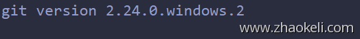

```go
package main
import (
    "strings"
    "bytes"
    "os"
    "os/exec"
    "fmt"
)
func runCmd(cmdStr string) string{
    list := strings.Split(cmdStr, " ")
    cmd := exec.Command(list[0],list[1:]...)
    var out bytes.Buffer
    var stderr bytes.Buffer
    cmd.Stdout = &out
    cmd.Stderr = &stderr
    err := cmd.Run()
    if err != nil {
        return stderr.String()
    } else {
        return out.String()
    }
}
func main(){
    fmt.Println(runCmd("git --version"))
}
```

命令输出：



