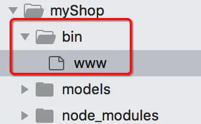

本文为转载文章，原文信息如下：

作者：全栈开发之道
链接：https://www.jianshu.com/p/e20831ad3185
来源：简书
著作权归作者所有。商业转载请联系作者获得授权，非商业转载请注明出处。

---

### 背景

> npm start 与 node app.js 的区别？ 写下这个标题，对于不清楚背景的人来说（也就是真正使用node开发项目的），不知所云。 因为二者本来没什么必然的联系，也就谈不上区别。 不过对于 MEAN 全栈初学者来说，产生这个疑问也合乎常理。

### 对于 node.js 开发者来说，首先接触到的就是 node app.js

回顾下node.js 的学习历程： 创建一个 应用程序， 通常命名为 app.js 或 server.js 。 那么，如何运行这个应用程序呢？

启动app.js 的方法： 打开终端窗口，进入到 app.js 文件所在的路径，

```shell
node app.js 
```

### npm start 又是怎么回事呢？

npm start 这个命令，是来自创建的 Express 工程。 我们可以创建 node.js 工程，也可以创建 express 工程。Express是基于node.js 的后台框架，用Express 会简单很多。

那么，如何创建 express 工程呢？

> (1) 全局安装 express：`sudo npm install -g express`
> (2) 安装 express 命令行工具：`sudo npm install -g express-generator`

打开终端窗口，进入到工程（文件夹）所在路径，执行命令：

> `express --view=ejs myShop`
> 需要注意的是，创建Express工程时，默认的视图模板引擎是Jade。在这个实例中，我们选用EJS模板引擎

Express 工程创建完毕后 ，在它的 package.json 文件中，有这么一行代码：


```json
"scripts": {
    "start": "node ./bin/www"
  },
  ```

`npm start` 命令，就是这么来的。 执行 `npm start` 指令，就相当于执行 `node ./bin/www`

www 文件才是 Express 应用的真正的入口。



仔细看下 www 文件的代码，如下：

```js
#!/usr/bin/env node

/**
 * Module dependencies.
 */

var app = require('../app');
var debug = require('debug')('myshop:server');
var http = require('http');

/**
 * Get port from environment and store in Express.
 */

var port = normalizePort(process.env.PORT || '3000');
app.set('port', port);

/**
 * Create HTTP server.
 */

var server = http.createServer(app);

/**
 * Listen on provided port, on all network interfaces.
 */

server.listen(port);
server.on('error', onError);
server.on('listening', onListening);

/**
 * Normalize a port into a number, string, or false.
 */

function normalizePort(val) {
  var port = parseInt(val, 10);

  if (isNaN(port)) {
    // named pipe
    return val;
  }

  if (port >= 0) {
    // port number
    return port;
  }

  return false;
}

/**
 * Event listener for HTTP server "error" event.
 */

function onError(error) {
  if (error.syscall !== 'listen') {
    throw error;
  }

  var bind = typeof port === 'string'
    ? 'Pipe ' + port
    : 'Port ' + port;

  // handle specific listen errors with friendly messages
  switch (error.code) {
    case 'EACCES':
      console.error(bind + ' requires elevated privileges');
      process.exit(1);
      break;
    case 'EADDRINUSE':
      console.error(bind + ' is already in use');
      process.exit(1);
      break;
    default:
      throw error;
  }
}

/**
 * Event listener for HTTP server "listening" event.
 */

function onListening() {
  var addr = server.address();
  var bind = typeof addr === 'string'
    ? 'pipe ' + addr
    : 'port ' + addr.port;
  debug('Listening on ' + bind);
}
```

如果把 www 文件中代码全部移到 app.js 中， 就可以用 node app.js 替代 npm start 了。

### 小结

从www 代码可以看出，配置了端口号 : 3000。 还有，增加了些异常处理。 这些异常处理机制，通常不用改动。 唯一有可能要改动的，就是 端口号。

浏览器访问时，http://localhost:3000 中的 3000 就是在这里设置的。
