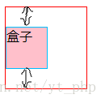
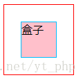

```css
display:flex;
justify-content: center;
```

检查侧轴是否居中，比如古代竖着写字，检查字是否在每条竹简的中央。


```css
display:flex;
align-items: center;
```

检查横轴是否居中，比如现代人是横着写字，检查字是否写在上下横线的中间。



```csss
display:flex;
justify-content: center;
align-items: center;
```

两者都加上就变成了居中的效果。



---

 flex布局中align-items和align-content的区别:

align-items和align-content有相同的功能，不过不同点是它是用来让每一个单行的容器居中而不是让整个容器居中。align-content属性只适用于多行的flex容器。

有点难懂，关键词：单行多行，看实例。


对于只有一行的flex元素，align-content是没有效果的，如果改用align-items:center;则会达到预期的效果，如下图 


但如果变成多行容器 使用align-items时效果如下


使用align-content效果如下


