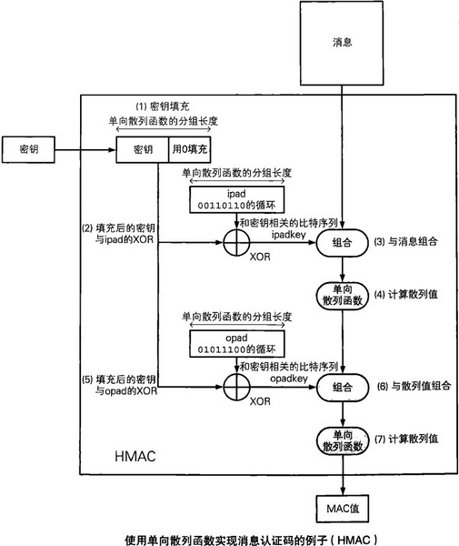
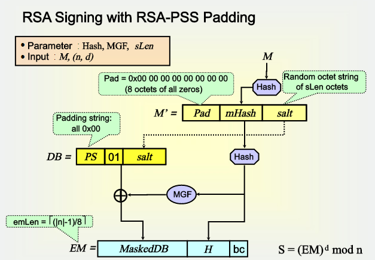
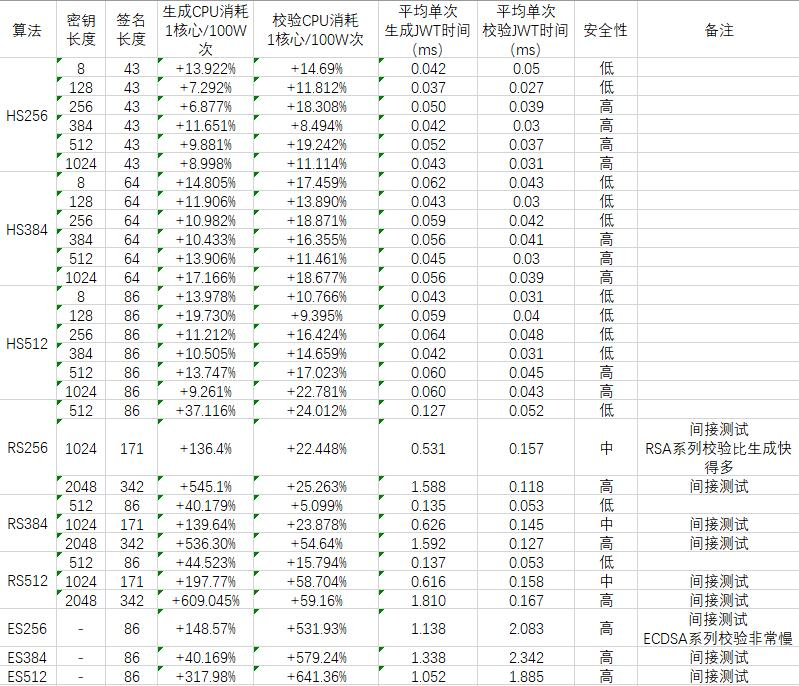
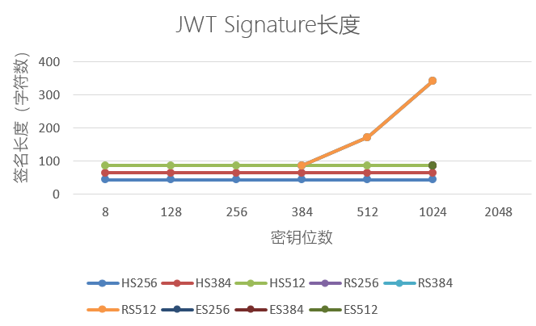
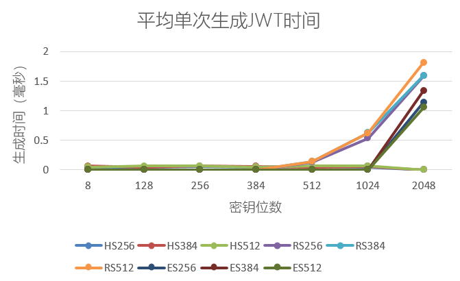
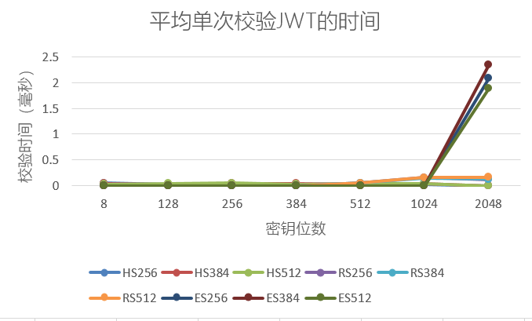
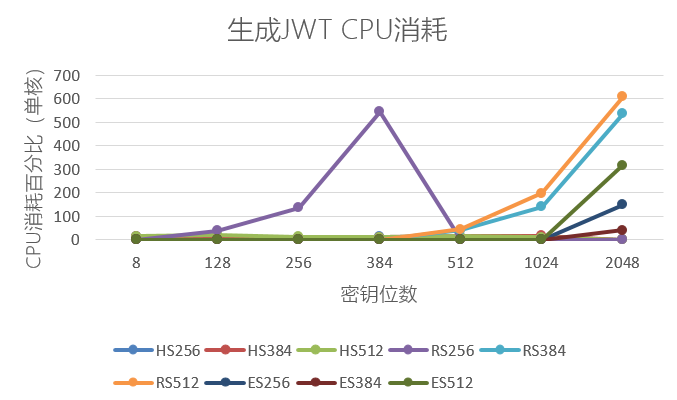

本文转载自：[http://www.bewindoweb.com/301.html | 三颗豆子](http://www.bewindoweb.com/301.html)，原作者允许转载。

---

# 一、背景

JWT（Json Web Token，RFC 7519）是常用的轻量级授权认证手段，常用于Web服务校验客户端身份。JWT分为三部分：

- Header：头部，明文，比如密钥IDkid、或者签名算法alg等等
- Payload：内容，明文，包含了业务的信息，比如可以加入一些不敏感的clientId等字段
- Signature：签名，利用“加密算法”对JWT进行签名，保证没有被篡改过
值得注意的是，这里的数据都是明文的，算法实际上执行的是最后的数据签名功能，只能保证“不被篡改”，而不是保证“不被解密”，所以后面看到“加密、解密”，其实都是为签名服务的。

## 签名

例如，一个完整的JWT形式是"Header.Payload.Signature"，中间用英文句号的“.”连接起来，如果选择的算法为HS256，那么会将前面的部分进行Base64编码之后，用密钥进行哈希签名，用表达式就是：

```
HMACSHA256(base64UrlEncode(header) + "." +base64UrlEncode(payload), secret)
```

## 验证
如何验证JWT的有效性呢，比较重要的方法就是验证是否被篡改，当JWT传给服务器之后，服务器用Header和Payload再次执行一次签名，然后比对本次计算得出的签名和JWT传过来的签名是否一致，就可以验证是否被篡改。另外还有一些对“过期时间”之类的校验，这些属于JWT的机制，和签名算法无关。

# 二、组件支持的加密方式

利用官方（[https://jwt.io/](https://jwt.io/)）推荐的java库，我们使用了 [com.auth0](https://github.com/auth0/java-jwt) 的JWT组件：

```xml
<dependency>
    <groupId>com.auth0</groupId>
    <artifactId>java-jwt</artifactId>
    <version>3.4.1</version>
</dependency>
```
它的加密方式支持情况如下：

| 加密方式 | 支持情况 | 全称 |
|--|--|--|
| HS256 | ✔ | HMAC with SHA-256 |
| HS384 | ✔	| HMAC with SHA-384 |
| HS512 | ✔	| HMAC with SHA-512 |
| PS256 | ✖	| RSAPSS with SHA-256 |
| PS384 | ✖	| RSAPSS with SHA-384 |
| RS256 | ✔	| RSAPSS with SHA-512 |
| RS384 | ✔	| RSASSA-PKCS1-v1_5 with SHA-256 |
| RS512 | ✔	| RSASSA-PKCS1-v1_5 with SHA-384 |
| ES256 | ✔	| RSASSA-PKCS1-v1_5 with SHA-512 |
| ES256K | ✔ | ECDSA with curve P-256 and SHA-256 |
| ES384 | ✔ |  |
| ES512 | ✔ | ECDSA with curve P-384 and SHA-384 |
| EdDSA | ✖ | Edwards-curve DSA |

有关具体选择什么组件，其实国内常见的就是上面的com.auth0，和 [jwtk/jjwt](https://github.com/jwtk/jjwt) 两种，当然也有博主推荐其他的组件，这些组件都大同小异，jjwt支持的加密算法更多一些，但是jwtk是一个个人账号，且contributor不多；而com.auth0是一个公司，相对而言我会倾向于能够盈利的公司，因为他们有能力提供长期开源支持。至于组件性能方面暂未测试，是马上要着手研究的方向。

# 三、算法加密方式简介

在比较签名算法之前，需要先了解一下原理，对算法有基本认知，便于测试预期。

## 3.1 SHA简介

SHA-2是一种散列算法（哈希函数），细分了6个算法标准，SHA-224、SHA-256、SHA-384、SHA-512、SHA-512/224、SHA-512/256，他们的差异大概是一些生成摘要长度、循环运行次数等。 

## 3.2 HMAC简介

HMAC（Hash-based Message Authentication Code）是对称加密，加密和解密用的是相同的密钥，主要用于消息防篡改，哈希算法可以选择md5、sha1、sha2（sha256，sha385，sha512）。 



- 如果密钥比分组长度短，则末尾填充0直到达到分组长度；如果密钥比分组长度还长，则会用哈希计算出密钥的散列值，然后让这个散列值作为HMAC的密钥，散列长度一般仍然小于分组长度，所以散列之后仍然要填充0。 
- 如果是SHA-1或SHA-256，则分组长度为64；如果是SHA-384和SHA-512。 
- 密钥长度如果小于哈希输出数据字长（SHA-256输出256位，所以为32，384为48，512为64），则加密效果不佳，如果超出这个长度，并不能带来显著的安全强度提升。 

另外，从官方jwt.io的网页推荐可以看出，也是希望使用和哈希函数匹配的长度（your-256-bit-secret）：


## 3.3 RSA相关简介

RSA是非对称加密，算法运行较慢。RSA没有加入随机数，因此如果攻击者遍历猜测所有的原文，可以通过对比相同的加密密文选择出真实原文，为了防止这种情况，RSA加入了padding机制，对数据进行填充。 



RSA主流的签名模式为RSA-PSS（Probabilistic Signature Scheme）和RSA-PCKS#1_v1.5（Public Key Cryptography Standards），PSS是私钥签名的填充模式（padding mode），相对而言这种方式更加安全，openssl-1.1.x以后（server key exchange阶段）默认使用PSS填充。 

发送方加密并不是对数据直接进行加密，而是通过SHA等散列函数对数据内容进行哈希之后，再对这个哈希值用公钥进行加密。接收方同样对内容计算SHA散列函数哈希值，然后用私钥解开加密的哈希值，比对两个哈希值是否一致，如果一致则说明数据内容没有被篡改过。 

如果业务上面只是自己签发自己验证JWT，公钥私钥都存放在同一个地方，从便利性角度而言和HMAC没有差异。

RSA有个选项是“密钥位数”，有512、1024、2048、4096等，尽管公私钥都是存在服务器的，但为了防止暴力猜测破解，仍然使用1024位以上比较安全。 

## 3.4 ECDSA

ECDSA（Elliptic Curve Digital Signature Algorithm，椭圆曲线数字签名算法）常常被用于比特币等区块链项目。防破解程度高，且计算比RSA更快。RSA是基于大数分解的原理，而ECDSA基于离散对数原理，没有亚指数时间的解决方法，因此强度更高。 


我们定义一个椭圆曲线的数学方程，所有的数字都规定只能使用整数：


x只能是整数，y关于x轴对称，p是一个素数且确保所有数值都在160位之内，y^2取值范围在0~p-1之间共p个可能值（由于y也必须是整数，所以只有部分能够取到）。整数限制和mod限制，使得这条曲线上只能够有有限的N个点（x，y坐标对）。 椭圆曲线的参数都是公开的，私钥是一个随机数，公钥是将原点G与私钥相乘后曲线上的一个点P。校验方式仍然是通过计算内容的SHA哈希，然后利用“椭圆曲线点乘法”，计算出相关的参数进行比对。只要初始随机数k是随机的，那么ECDSA在普通时间是无法被攻击者破解的。

这部分的内容我能够理解它的目的，但实际上并没有完全地看懂为什么，以后有机会一定要研究透彻，因为椭圆曲线其实是现在常用的算法了。相关资料贴一下：[《一文读懂ECDSA算法如何保护数据》](https://zhuanlan.zhihu.com/p/97953640)

有几个问题值得注意：

- jdk1.7才开始内置SCDSA的支持（https://docs.oracle.com/javase/7/docs/technotes/guides/security/p11guide.html#ALG）。
- 椭圆曲线的选择十分重要，好的椭圆曲线可以提升性能等。普通的ECDSA使用p-256曲线，ES256K是指区块链常用的secp256k1曲线（在一些区块链文档中经常被提到，比如 https://www.doc88.com/p-8941799846501.html，但资料太少未查证）。 

## 3.5 EdDSA

区块链相关的加密算法通常采用ECDSA，但配置不好的话很容易产生安全问题，且速度仍然较慢，EdDSA（Edwards-curve Digital Signature Algorithm）是2012年提出的爱德华曲线数字签名算法，不牺牲安全性的同时提高签名、验签的速度，是目前最好的算法，但资料较少，没有搜索到原理，组件支持方面也不太好。官方的java组件全都是“支持中”的问号： 


在Go组件中也很多问号，只有2个没有太多star的组件支持了该算法。因此即使这种方式又快又好，也暂时不考虑，因为无法应用到生产中去。

# 四、加密算法对比测试

暂时不对比PS256系列算法（安全性仅仅比RSA普通padding略好）、ES256k（不常见且支持不太好），EdDSA系列算法（最新算法，没有支持的组件）。

## 4.1 测试方法

代码放在了：[https://github.com/BEWINDOWEB/bwbscripts/tree/main/jwttest](https://github.com/BEWINDOWEB/bwbscripts/tree/main/jwttest)

直接用Springboot打印测试的，记得在冷启动之后等待Springboot消耗的CPU稳定后再测试。

1. 使用com.auth0 java-jwt 3.4.1组件进行生成和校验。
2. 采用Prometheus采集CPU指标，通过打印内容采集时间指标，采集间隔为30秒，所以可能存在一定误差，计算CPU指标的方式为：根据打印的开始、结束时间戳，找到对应的坐标位置数据进行计算，如果坐标位置恰好处于30秒期间没有被采集，则利用两个端点的值进行加权平均计算。
3. 测试资源为1000mCPU、1G内存的K8S pod。每测试一项，就重启一次pod（模拟冷启动），避免因为GC导致占用CPU或者HotSpot导致优化而影响实验结果。每次重启完毕，等待CPU指标稳定后，再开始测试。（在pod启动之后CPU指标会上下波动，应该是在初始化处理一些什么内容，然后过4分钟左右，会有一个CPU指标突然下降的过程，下降完之后就会保持平稳了。另外不要只开1个pod等待，不然会耗费很长时间测试，可以开4个pod轮换着使用） 


4. 请求的方式为通过Sleep的pod执行curl发起携带参数的HTTP请求触发执行。
5. 内存消耗都在合理范围。
6. 间接测试指的是，按照100W请求直接测试，将会消耗掉100%的单核CPU而崩溃，因此间接以10W、50W循环次数进行测试，再乘以10、2倍数，最后取得平均值，来符合100W的循环次数。（该方法并不是严谨的方法）
7. 所有测试都是单线程循环，没有线程池。
8. 生成密钥的方式：
```bash
// rsa
openssl genrsa -out RSA_512_pri.pem 512
openssl rsa -in RSA_512_pri.pem -out RSA_512_pub.txt -pubout
openssl genrsa -out RSA_1024_pri.pem 1024
openssl rsa -in RSA_1024_pri.pem -out RSA_1024_pub.txt -pubout
openssl genrsa -out RSA_2048_pri.pem 2048
openssl rsa -in RSA_2048_pri.pem -out RSA_2048_pub.txt -pubout
openssl pkcs8 -topk8 -inform PEM -in RSA_512_pri.pem -outform PEM -nocrypt > RSA_512_pri.txt
openssl pkcs8 -topk8 -inform PEM -in RSA_1024_pri.pem -outform PEM -nocrypt > RSA_1024_pri.txt
openssl pkcs8 -topk8 -inform PEM -in RSA_2048_pri.pem -outform PEM -nocrypt > RSA_2048_pri.txt
 
// ecdsa
openssl ecparam -name prime256v1 -genkey -out ECDSA_p256_pri.pem
openssl ec -in ECDSA_p256_pri.pem -pubout -out ECDSA_p256_pub.txt
openssl pkcs8 -topk8 -inform PEM -in ECDSA_p256_pri.pem -outform PEM -nocrypt >ECDSA_p256_pri.txt
```

## 4.2 测试结果



### 4.2.1 JWT signature长度



- 在JWT signature长度方面，目前HS256是长度最小的（43个字符），其余的长度均比它大。
- 在同样的加密算法中，任意的密钥长度对signature长度没有影响。

### 4.2.2 生成JWT速度比较



- 在生成JWT速度方面，HMAC > RSA = ECDSA。
- 在同类加密算法里，SHA位数对加密算法没有太大影响；
- 在同类加密算法里，密钥位数的升高会导致时延升高，但也控制在1ms内，几乎可以忽略不计。
- ECDSA在和同等复杂度的RSA比较时，会优于RSA一点点，但也可以忽略不计。 

### 4.2.3 校验JWT速度



- 在校验JWT速度方面，HMAC > RSA > ECDSA。
- 在同类加密算法里，SHA位数对加密算法没有太大影响
- 在同类加密算法里，密钥位数的升高会导致时延升高，同样控制在1ms左右，几乎可以忽略不计。
- RSA解密速度优于ECDSA。 

### 4.2.4 生成JWT的CPU消耗



- 在生成JWT的CPU消耗方面，HMAC << ECDSA < RSA。
- 在同类加密算法里，SHA位数越高，CPU消耗越多，而且升高非常巨大。
- 在同类加密算法里，密钥位数的升高会导致CPU使用率升高，但变化在10%左右，不明显。 

### 4.2.5 校验JWT的CPU消耗


- 在校验JWT的CPU消耗方面，HAMC < RSA << ECDSA
- 在同类加密算法里，SHA位数越高，CPU消耗越多，但变化不明显。
- 在同类加密算法里，密钥位数的升高会导致CPU使用率升高，但变化不明显

### 4.2.6 列表比较

| 比较项 | 考虑因素 | 结论 |
|--|--|--|
| 签名长度 | 使用方的内存占用 | HS、ES可以接受，RS过长 |
| 生成速度 | 频繁生成JWT的业务 | HS最快，RS和ES接近 |
| 校验速度 | 频繁校验JWT的业务 | HS最快，RS略慢，ES很慢 |
| 生成CPU | 对CPU资源有要求 | HS最少，RS、ES都较多，RS略少于ES |
| 校验CPU | 对CPU资源有要求 | HS和RS都很少，ES较多 |

## 4.3 优缺点和适用场景

（1）HS256 / HS384 / HS512

- 优点：速度快、生成校验CPU少、签名位数少
- 缺点：对称加密，密钥泄漏影响大；不适合多服务校验场景
- 注意：密钥位数的提高并不能显著提高安全性。

（2）RS256 / RS384 / RS512

- 优点：校验速度可以接受、安全等级高、适合多服务校验场景
- 缺点：CPU消耗较大，生成速度较慢（但生成一般都是低频率事件），签名位数多（有嵌入式设备一定要注意了）

（3）ES256 / ES256K / ES384 / ES512

- 优点：安全等级高、适合多服务校验场景
- 缺点：CPU消耗严重（对普通应用不划算的）、生成和校验速度较慢，尤其是校验速度

【推荐方案选择】

- 普通应用推荐使用HS，并且定期轮换密钥避免对称性加密密钥泄漏的风险；

- 较为复杂的应用可用RS

- 安全应用可用ES

