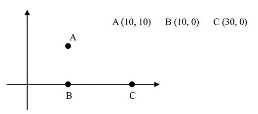

本题同时存在于，除输入数据的输入顺序外无任何区别，此处使用题目描述更详细的一本通的原题，洛谷题目思路完全相同，代码唯一区别会在注释中标明。

# [1487：【例 2】北极通讯网络](http://ybt.ssoier.cn:8088/problem_show.php?pid=1487)

#### 题目描述

原题来自：Waterloo University 2002

北极的某区域共有 $n$ 座村庄，每座村庄的坐标用一对整数 ($x,y$) 表示。为了加强联系，决定在村庄之间建立通讯网络。通讯工具可以是无线电收发机，也可以是卫星设备。所有的村庄都可以拥有一部无线电收发机， 且所有的无线电收发机型号相同。但卫星设备数量有限，只能给一部分村庄配备卫星设备。

不同型号的无线电收发机有一个不同的参数 $d$，两座村庄之间的距离如果不超过 $d$ 就可以用该型号的无线电收发机直接通讯，$d$ 值越大的型号价格越贵。拥有卫星设备的两座村庄无论相距多远都可以直接通讯。\n现在有 $k$ 台卫星设备，请你编一个程序，计算出应该如何分配这 $k$ 台卫星设备，才能使所拥有的无线电收发机的 $d$ 值最小，并保证每两座村庄之间都可以直接或间接地通讯。

例如，对于下面三座村庄：



其中 $|AB|=10,|BC|=20,|AC|=10 \sqrt{5}≈22.36$

如果没有任何卫星设备或只有 $1$ 台卫星设备 ($k=0$ 或 $k=1$)，则满足条件的最小的 $d=20$，因为 $A$ 和 $B$，$B$ 和 $C$ 可以用无线电直接通讯；而 $A$ 和 $C$ 可以用 $B$ 中转实现间接通讯 (即消息从 $A$ 传到 $B$，再从 $B$ 传到 $C$)；

如果有 $2$ 台卫星设备 ($k=2$)，则可以把这两台设备分别分配给 $B$ 和 $C$ ，这样最小的 $d$ 可取 $10$，因为 $A$ 和 $B$ 之间可以用无线电直接通讯；$B$ 和 $C$ 之间可以用卫星直接通讯；$A$ 和 $C$ 可以用 $B$ 中转实现间接通讯。

如果有 $3$ 台卫星设备，则 $A,B,C$ 两两之间都可以直接用卫星通讯，最小的 $d$ 可取 $0$。

#### 输入格式

第一行为由空格隔开的两个整数 $n,k$;\n第 $2∼n+1$ 行，每行两个整数，第 $i$ 行的 $x_i,y_i$​ 表示第 $i$ 座村庄的坐标 ($x_i, y_i$)。

#### 输出格式

一个实数，表示最小的 $d$ 值，结果保留 $2$ 位小数。

#### 输入输出样例

In 1：

```text
3 2
10 10
10 0
30 0
```

Out 1：

```text
10.00
```

#### 数据范围

对于全部数据，$1≤n≤500,0≤x,y≤10^4,0≤k≤100$。

#### 题解

水题，不知道为什么花了我这么久时间

~~我一定没有摸鱼~~

显然，当卫星设备数为 $0$ 或 $1$ 时，本题退化为最小生成树求最长边，这个大家应该都可以理解的对吧。

那么，如果这时候有 $2$ 套卫星设备会怎样？这是比排队接水还简单的贪心了吧，就是把最小生成树中的最长边去掉，这个边连接的两个村庄之间用卫星设备，答案也就变成了最小生成树中第二长的边。

如果你一定要进一步证明，那么就这么想：

- 这道题要求最大边最小 => 最小生成树
- 卫星设备的作用是将多个连通图连通在一起，且不产生新的边
- 为了继续保证最大边最小，这多个连通图也要是最小生成树才行
- 最小生成树删去 $k-1$ 条边变成 $k$ 个树，这 $k$ 个树也一定都是其中包含的点能组成的最小生成树
- 进而地，最有情况就是在所有点组成的最小生成树的基础上再删掉 $k$ 条最长的边

可以总结规律了。$k$ 台卫星设备可以连接 $k$ 个最小生成树为一个整体，那么也就是说整个最小生成树可以少 $k$ 条边。少哪 $k$ 条边呢？自然是最长的 $k$ 条边。这样子一来，答案就是最小生成树中第 $(n - 1) - k$ 条边的长度，其中 $n-1$ 就是最小生成树中边的个数。

由于题目数据实在是太水了，$n$ 才有 $500$，完全没必要考虑堆优化。直接用裸模板就行。

```cpp
#include <bits/stdc++.h>
using namespace std;

int n, k, m[501][2];

struct Edge {
    double f, t, w;
} edge[250000], edges[501];  // edge是所有的边，edges记录所有加入了最小生成树的边
bool cmp(Edge a, Edge b) { return a.w < b.w; }

class bcj {  // 用类实现并查集可以省去全局变量冲突的烦恼，看起来更清爽
   public:
    int f[250000];
    void init(int n) {
        for (int i = 1; i <= n; i++) {
            f[i] = i;
        }
    }
    int find(int x) {
        while (f[x] != x) {
            f[x] = f[f[x]];
            x = f[x];
        }
        return x;
    }
    void merge(int x, int y) {
        int fx = find(x), fy = find(y);
        if (fx != fy) {
            f[fx] = fy;
        }
    }
};

int main() {
    cin >> n >> k;
    // cin >> k >> n;  // 提交洛谷用这一行
    for (int i = 1; i <= n; i++) {
        cin >> m[i][0] >> m[i][1];
    }
    int cnt = 0;
    for (int i = 1; i <= n; i++) {
        for (int j = i + 1; j <= n; j++) {
            edge[++cnt].f = i;
            edge[cnt].t = j;
            edge[cnt].w =
                sqrt(pow(m[i][0] - m[j][0], 2) + pow(m[i][1] - m[j][1], 2));
        }
    }
    sort(edge + 1, edge + cnt + 1, cmp);
    bcj b;
    b.init(n);
    int cntt = 0;
    for (int i = 1; i <= cnt && cntt < n; i++) {
        if (b.find(edge[i].f) != b.find(edge[i].t)) {
            b.merge(edge[i].f, edge[i].t);
            edges[cntt++] = edge[i];
        }
    }
    if (k <= 1) {
        printf("%.2f\n", edges[cntt - 1].w);
    } else {
        printf("%.2f\n", edges[cntt - k].w);
    }
    return 0;
}
```

