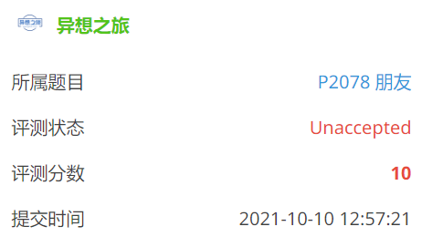
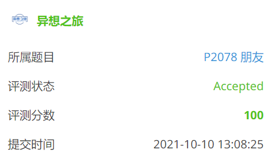

#### 题目背景

小明在 A 公司工作，小红在 B 公司工作。

#### 题目描述

这两个公司的员工有一个特点：一个公司的员工都是同性。

A 公司有 N 名员工，其中有 P 对朋友关系。B 公司有 M 名员工，其中有 Q 对朋友关系。朋友的朋友一定还是朋友。

每对朋友关系用两个整数 (Xi,Yi) 组成，表示朋友的编号分别为 Xi,Yi 。男人的编号是正数，女人的编号是负数。小明的编号是 1，小红的编号是 -1。

大家都知道，小明和小红是朋友，那么，请你写一个程序求出两公司之间，通过小明和小红认识的人最多一共能配成多少对情侣（包括他们自己）。

#### 输入格式

输入的第一行，包含 4 个空格隔开的正整数 N,M,P,Q。

之后 P 行，每行两个正整数 Xi,Yi 。

之后 QQ 行，每行两个负整数 Xi,Yi 。

#### 输出格式

输出一行一个正整数，表示通过小明和小红认识的人最多一共能配成多少对情侣（包括他们自己）。

---

几乎又是一道并查集模板。

我最开始读题，觉得有一个地方是可以引起歧义的（毕竟不是官方题描述没那么完美很正常）：**请你写一个程序求出两公司之间，通过小明和小红认识的人最多一共能配成多少对情侣**。

两公司？一个公司可以内部消化吗？

后来我发现是自己的问题……

**一个公司的员工都是同性。**

这样的话没事了。

算法分析：并查集模板，使用 STL map 完成数组的负数下标实现。

代码：

```cpp
#include <bits/stdc++.h>
using namespace std;
map<int, int> f;
int find(int a) {
    if (f[a] != a)
        return f[a] = find(f[a]);
    else
        return a;
}
int hb(int a, int b) { f[find(b)] = find(a); }

int main() {
    int n, m, p, q;
    cin >> n >> m >> p >> q;
    for (int i = -m; i <= n; i++) {
        if (i == 0) continue;
        f[i] = i;
    }
    f[-1] = f[1];
    int x, y;
    while (p--) {
        cin >> x >> y;
        hb(x, y);
    }
    while (q--) {
        cin >> x >> y;
        hb(x, y);
    }
    int girl = 0, boy = 0;
    for (int i = -m; i < 0; i++) {
        if (find(i) == 1) girl++;
    }
    for (int i = 1; i <= n; i++) {
        if (find(i) == 1) boy++;
    }
    cout << min(boy, girl);
    return 0;
}
```

最后的统计就是在小明和小红的所有朋友中输出男女总数小的一个。

样例OK，远端……



#### 问题出现了！！！

这个实现按理是没有问题的（至少我现在没有发现，要是以后解决了来说解决方案），题解也有这样的解决方案：

[题解 P2078 【朋友】 - SSL_XXY_BlackCloud 的博客 - 洛谷博客](https://www.luogu.com.cn/blogs/SSL-XXY/solution-p2078)

小号测试，题解这个代码的确可以AC


好吧，这样的话那我们换一种思路：map换成数组，男生存储位置不变，女生的位置变成编号的绝对值（因为编号为负 所以也就是相反数）加上n

AC代码：

```cpp
#include <bits/stdc++.h>
using namespace std;

int f[1000001];

int find(int a) {
    if (f[a] != a) {
        return f[a] = find(f[a]);
    } else {
        return a;
    }
}

int hb(int a, int b) { f[find(b)] = find(a); }

int main() {
    int n, m, p, q;
    cin >> n >> m >> p >> q;
    for (int i = 1; i <= n + m; i++) {
        f[i] = i;
    }
    f[n + 1] = f[1];

    int x, y;
    while (p--) {
        cin >> x >> y;
        hb(x, y);
    }
    while (q--) {
        cin >> x >> y;
        hb(-x + n, -y + n);
    }

    int girl = 0, boy = 0;
    for (int i = 1; i <= n; i++) {
        if (find(i) == find(1)) boy++;
    }
    for (int i = n + 1; i <= n + m; i++) {
        if (find(i) == find(1)) girl++;
    }

    cout << min(boy, girl);
    

    return 0;
}
```



---

比较这三次的用时，可以看出其实map在时间和空间都没有优势……所以可能只是题解优化稍微好点 然后我的超时/超内存了？


所以以后除非遇到string对其他类型的映射，否则还是老老实实数组吧……
