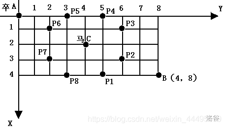

#### 题目描述

棋盘上 A 点有一个过河卒，需要走到目标 B 点。卒行走的规则：可以向下、或者向右。同时在棋盘上 C 点有一个对方的马，该马所在的点和所有跳跃一步可达的点称为对方马的控制点。因此称之为“马拦过河卒”。

棋盘用坐标表示，A 点 (0,0)、B 点 (n,m)，同样马的位置坐标是需要给出的。



现在要求你计算出卒从 AA 点能够到达 BB 点的路径的条数，假设马的位置是固定不动的，并不是卒走一步马走一步。

#### 输入格式
一行四个正整数，分别表示 B 点坐标和马的坐标。

#### 输出格式
一个整数，表示所有的路径条数。

#### 输入输出样例

In 1
```
6 6 3 3
```

Out 1
```
6
```

#### 说明/提示
对于 100% 的数据，1≤n,m≤20，0≤ 马的坐标 ≤20。

---

只能向下或向右走

那么对于每一个点卒只能从左边或上边来

当前点路径条数=左边点路径条数+上边点路径条数

对于马控制的点，路径条数为0

先初始化第一行和第一列，然后逐个递推求解即可

```cpp
#include <bits/stdc++.h>
using namespace std;

bool g[23][23];
long long f[21][21];
int plu[2][8] = {{2, 2, -2, -2, 1, 1, -1, -1}, {1, -1, 1, -1, 2, -2, 2, -2}};

int main() {
    int n, m, cx, cy;
    cin >> n >> m >> cx >> cy;

    g[cx][cy] = 1;

    for (int i = 0; i < 8; i++) {
        if ((cx + plu[0][i]) <= n && cy + plu[1][i] <= m)
            g[cx + plu[0][i]][cy + plu[1][i]] = 1;
    }

    f[0][0] = 1;

    for (int i = 1; i <= n; i++) {
        if (!g[i][0])
            f[i][0] = f[i - 1][0];
        else
            f[i][0] = 0;
    }

    for (int i = 1; i <= m; i++) {
        if (!g[0][i])
            f[0][i] = f[0][i - 1];
        else
            f[0][i] = 0;
    }

    for (int i = 1; i <= n; i++) {
        for (int j = 1; j <= m; j++) {
            if (!g[i][j])
                f[i][j] = f[i - 1][j] + f[i][j - 1];
            else
                f[i][j] = 0;
        }
    }

    cout << f[n][m];

    return 0;
}

```

---

莫名感觉小学奥数在新东方学过一个这样的东西，当时是手动模拟来着
