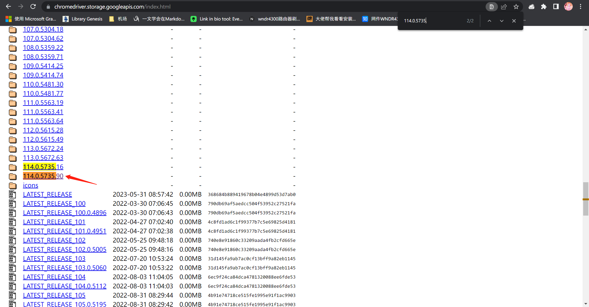

截至目前，Chrome 仍是最好用的浏览器，没有之一。Chrome 不仅是日常使用的利器，通过 Chrome Driver 驱动和 selenium 等工具包，在执行自动任务中也是一绝。相信大家对 selenium 在 Windows 的配置使用已经有所了解了，下面就让我们看看如何在 Linux 上配置使用 selenium 吧（**无图形化界面也可用的方法！**）

本文介绍的方法仅 Debian 系可用。

## 安装 Chrome

首先下载 Chrome 本体，直接使用 wget 即可。

```bash
wget https://dl.google.com/linux/direct/google-chrome-stable_current_amd64.deb
```

经本人测试（2023.7.9，青岛联通家用宽带），本文所提及的所有谷歌相关链接均**不需要**科学上网。

然后安装即可：

```bash
sudo dpkg -i google-chrome-stable_current_amd64.deb
```

如果成功了，那么恭喜你可以直接进入下一步；而经测试，这一步大概率会报错提示缺少依赖，没有关系，现在只需要运行下面这句代码，再重新执行一遍安装命令即可：

```bash
sudo apt-get install -f
```

## 安装chrome-driver

执行下面的代码查看 Chrome 版本：

```bash
google-chrome -version
```

然后在 <https://chromedriver.storage.googleapis.com/index.html> 中寻找对应版本的 Chrome Driver（可使用 `Ctrl + F` 进行搜索）。没有完全对应的版本没关系，下载一个与之最接近的即可，例如我的版本号为 `114.0.5735.198`，于是我选择了 `114.0.5735.90`。




在新界面中下载 linux64 版本（复制链接，使用 wget 下载即可），然后解压缩，并复制到 `/usr/bin` 目录下以方便程序使用（如果不放入这个目录，则需要在后续的 Python 程序中手动指定 Driver 位置）


```bash
wget https://chromedriver.storage.googleapis.com/114.0.5735.90/chromedriver_linux64.zip
unzip chromedriver_linux64.zip
sudo cp chromedriver /usr/bin
```

## 测试

安装 `selenium` 模块并尝试启动 Chrome。

将以下测试脚本写入 `test.py`

:::: code-group
::: code-group-item 普通

```python
from selenium import webdriver
from selenium.webdriver.chrome.options import Options


def init_driver():
    options = Options()
    options.add_argument('--no-sandbox') # 亲测 Debian 必须加，Ubuntu 随意
    options.add_argument("--headless")
    options.add_argument('--disable-gpu')
    driver = webdriver.Chrome(options=options)
    return driver

init_driver()

print('Success')
```

:::
::: code-group-item 指定Driver路径

```python
from selenium import webdriver
from selenium.webdriver.chrome.options import Options
from selenium.webdriver.chrome.service import Service


def init_driver():
    options = Options()
    options.add_argument('--no-sandbox') # 亲测 Debian 必须加，Ubuntu 随意
    options.add_argument("--headless")
    options.add_argument('--disable-gpu')
    service = Service(executable_path='/root/chromedriver')
    driver = webdriver.Chrome(options=options, service=service)
    return driver

init_driver()

print('Success')
```

:::
::::

通过 pip 安装 selenium 并运行脚本，看到成功提示即可。

```bash
pip install selenium
python3 test.py
```
