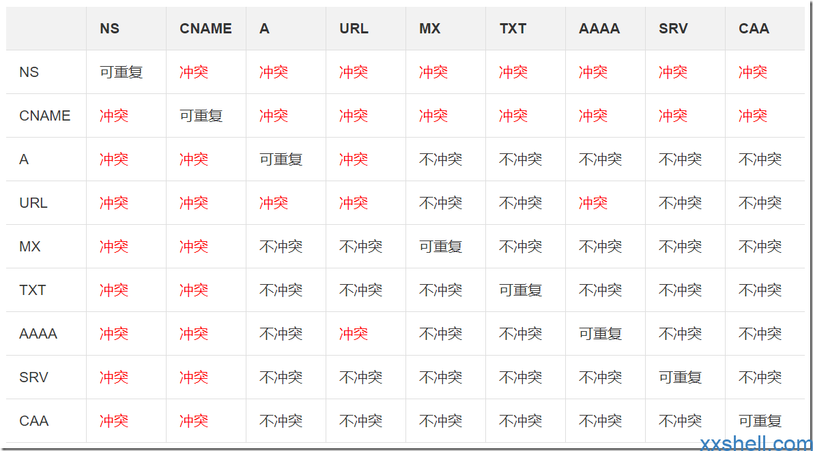

> 本人使用谷歌搜索了简中互联网，完全没有找到任何有关 ANAME 的文章……本文该不会是头一份吧

相信大家对于 DNS 的解析方式都不陌生，常见的有 A、CNAME、MX、TXT 记录等等。其中，网站常用的是 A 记录和 CNAME 记录：A 记录用于将域名解析为 IP 地址，CNAME 记录用于将域名解析为另一个域名。而 MX 则是用于邮件服务器的解析。

然而，这里出现了一个问题：根据传统的 DNS 解析模式，对于根域名（即主机名为`@`时），CNAME 和 MX 记录是冲突的。

此处[转载](https://www.xxshell.com/2542.html)一张图给大家看看同一主机名下哪些解析会冲突：

显然，我们一般不会去给邮箱服务器加前缀，而直接让客户配置 A 记录显然是无法满足业务需求的（尤其对于 CDN 服务器），因此许多时候比较好的选择是 DNS 服务商提供一个服务器，将对根域名的访问通过 301 重定向到带有 www 的域名。

这时候，一些国外的域名服务商发明了 ANAME 解析这个东西。我们看看 [name.com](https://www.name.com/support/articles/115010493967-adding-an-aname-alias-record) 对它的解释：

An ANAME record is a Name.com-specific feature that automatically finds and updates A and AAAA records from the target. Unlike CNAME records, ANAMEs can be placed next to other records (one per hostname). ANAME records are commonly known as ALIAS records or CNAME flattening.

> 翻译：ANAME 记录是 Name.com 特定的功能，可自动查找并更新目标中的 A 和 AAAA 记录。与 CNAME 记录不同，ANAME 可以放置在其他记录旁边（每个主机名一个）。ANAME 记录通常称为 ALIAS 记录或 CNAME 扁平化。

看不懂也没关系，知道它比 CNAME 有过而无不及就够了。

至于具体的实现原理，我没有找到非常好的解释，从[这篇文章](https://constellix.com/news/what-is-an-aname-record)中，我找到了大体的描述：

> 当查询 ANAME 记录时，实际上是要求权威名称服务器解析 ANAME 记录中存储的主机或 FQDN。如果由于某种原因无法解析 ANAME 记录，则会返回最近缓存的 IP 地址。这样，您就可以避免任何不必要的停机。

个人理解，也就是说正常你拿到一个 CNAME 解析结果之后需要再去解析这个 CNAME 结果域名，而 ANAME 则在 DNS 服务商处解决这一问题。
