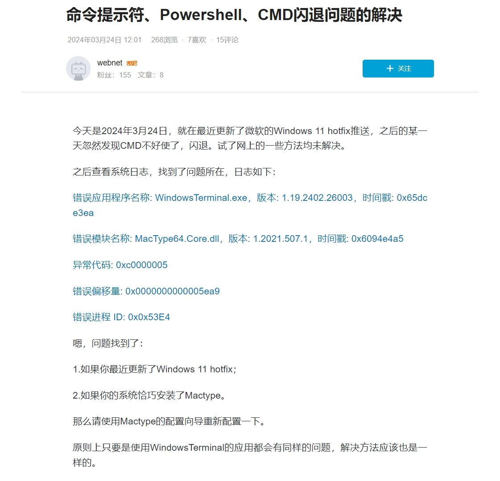
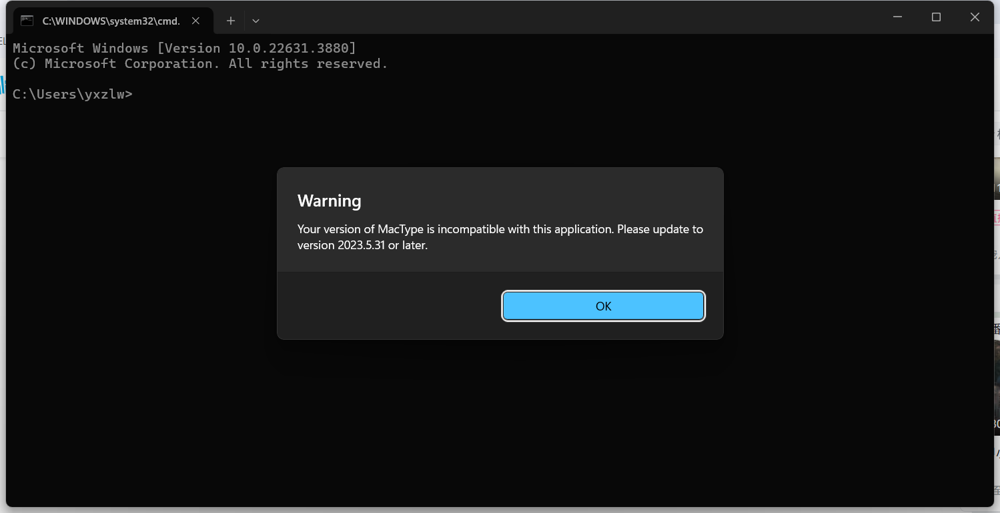

原文地址：[https://www.bilibili.com/read/cv33373799/](https://www.bilibili.com/read/cv33373799/)，（作者：webnet）。本次转载已获得授权：


文章解决了新版本 Windows 11 的 Terminal 与 MacType 同时使用时可能出现的闪退问题。

---

今天是2024年3月24日，就在最近更新了微软的Windows 11 hotfix推送，之后的某一天忽然发现CMD不好使了，闪退。试了网上的一些方法均未解决。

之后查看系统日志，找到了问题所在，日志如下：

```
错误应用程序名称: WindowsTerminal.exe，版本: 1.19.2402.26003，时间戳: 0x65dce3ea

错误模块名称: MacType64.Core.dll，版本: 1.2021.507.1，时间戳: 0x6094e4a5

异常代码: 0xc0000005

错误偏移量: 0x0000000000005ea9

错误进程 ID: 0x0x53E4
```

嗯，问题找到了：

1. 如果你最近更新了Windows 11 hotfix；

2. 如果你的系统恰巧安装了Mactype。

那么请使用Mactype的配置向导重新配置一下。

原则上只要是使用WindowsTerminal的应用都会有同样的问题，解决方法应该也是一样的。



---

补充更新（以下内容不是转载）

Windows 在不知道哪一个版本的更新中给 Terminal 加入了这样的提示



然而上面的操作执行后这两个软件相处还挺融洽的，我没啥动力去升级 MacType，就先这样吧🤣
