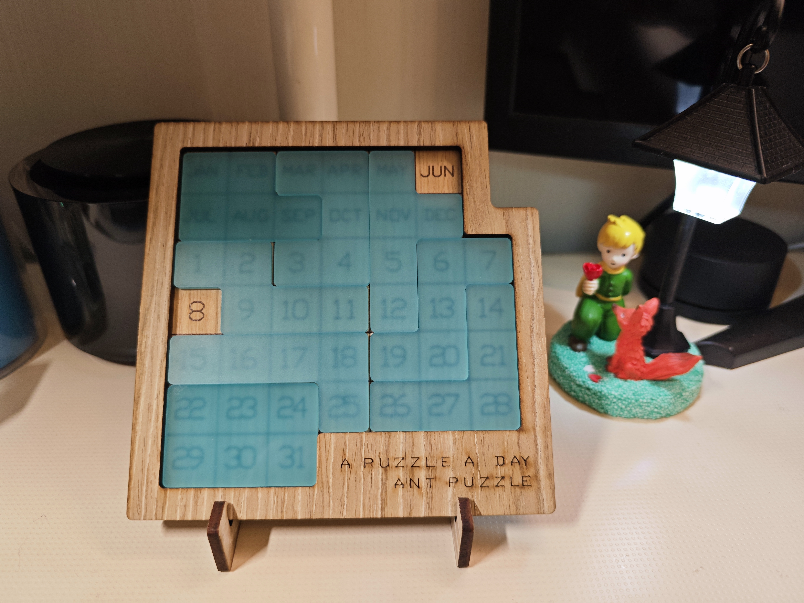
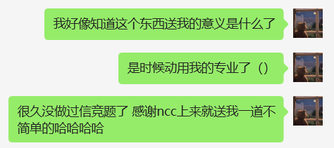

> 信竞退役这么久，难得又有了一篇可以打算法tag的文章。

前两天收到 ncc 同学送的生日礼物——



一个需要每天手动重新拼拼图的日历

然而，我研究了许久……一个日期也没拼出来\[手动裂开\]

正在我一筹莫展的时候我想到了我的专业：



那么剩下的事情就变得简单了！


:::: code-group
::: code-group-item main.py

```python
from blocks import blocks, total_blocks
from map import MAP, set_date


def output():
    for line in MAP:
        print(" ".join(f"{num:>{3}}" for num in line))


def dfs(block_cnt):
    if block_cnt == total_blocks:
        print("Success!")
        output()
        exit(0)

    # 寻找可放置拼图的点
    for x in range(len(MAP) - 1):
        for y in range(len(MAP[x])):
            if MAP[x][y] != 0:
                continue
            try:
                if MAP[x - 1, y] != 0 and MAP[x, y - 1] != 0 and MAP[
                        x + 1, y] != 0 and MAP[x, y + 1] != 0:
                    return
            except:
                ...
            # 尝试以这个点为左上角放置拼图
            for block in blocks[block_cnt]:
                # 检测该拼图是否能放置
                flag = True
                try:
                    for dot in block:
                        if MAP[x + dot[0]][y + dot[1]] != 0:
                            flag = False
                            break
                except IndexError:
                    flag = False
                if not flag:
                    continue
                for dot in block:
                    MAP[x + dot[0]][y + dot[1]] = block_cnt + 1
                # print(x, y, block_cnt + 1)
                dfs(block_cnt + 1)
                for dot in block:
                    MAP[x + dot[0]][y + dot[1]] = 0


if __name__ == '__main__':
    date = [int(i) for i in input('请输入日期：').split('.')]
    set_date(date[0], date[1])
    dfs(0)
    print("Fail!")
```

:::
::: code-group-item blocks.py

```python
_blocks = [
    [(0, 0), (0, 1), (0, 2), (1, 0), (1, 2)],
    [(0, 0), (0, 1), (0, 2), (0, 3), (1, 3)],
    [(0, 0), (0, 1), (0, 2), (1, 2), (1, 3)],
    [(0, 0), (0, 1), (0, 2), (1, 0), (1, 1), (1, 2)],
    [(0, 0), (0, 1), (0, 2), (1, 1), (1, 2)],
    [(0, 0), (1, 0), (1, 1), (1, 2), (2, 2)],
    [(0, 0), (0, 1), (0, 2), (1, 2), (2, 2)],
    [(0, 0), (1, 0), (1, 1), (2, 0), (3, 0)],
]

total_blocks = len(_blocks)


def rotate_90(puzzle):
    return [(y, -x) for x, y in puzzle]


def rotate_180(puzzle):
    return [(-x, -y) for x, y in puzzle]


def rotate_270(puzzle):
    return [(-y, x) for x, y in puzzle]


def translate_to_positive(puzzle):
    min_x = min(x for x, y in puzzle)
    min_y = min(y for x, y in puzzle)
    return [(x - min_x, y - min_y) for x, y in puzzle]


def generate_rotations(puzzle):
    rotations = [puzzle]
    rotations.append(translate_to_positive(rotate_90(puzzle)))
    rotations.append(translate_to_positive(rotate_180(puzzle)))
    rotations.append(translate_to_positive(rotate_270(puzzle)))
    return [translate_to_positive(rotation) for rotation in rotations]


blocks = [generate_rotations(block) for block in _blocks]

if __name__ == '__main__':
    for block in blocks:
        print(block)
        print()
```

:::
::: code-group-item map.py

```python
MAP = [
    [0, 0, 0, 0, 0, 0],
    [0, 0, 0, 0, 0, 0],
    [0, 0, 0, 0, 0, 0, 0],
    [0, 0, 0, 0, 0, 0, 0],
    [0, 0, 0, 0, 0, 0, 0],
    [0, 0, 0, 0, 0, 0, 0],
    [0, 0, 0],
]


def set_date(month, day):
    if month <= 6:
        MAP[0][month - 1] = -1
    elif month <= 12:
        MAP[1][month - 7] = -1
    else:
        raise ValueError("Invalid month")

    if day <= 7:
        MAP[2][day - 1] = -1
    elif day <= 14:
        MAP[3][day - 8] = -1
    elif day <= 21:
        MAP[4][day - 15] = -1
    elif day <= 28:
        MAP[5][day - 22] = -1
    elif day <= 31:
        MAP[6][day - 29] = -1
    else:
        raise ValueError("Invalid day")
```

:::
::::

这次`blocks.py`主要贡献者为ChatGPT，对话链接（未来抄GPT代码的我都贴出来一下）：<https://chatgpt.com/share/8c4ad0e3-b66b-4391-81a9-07e9f42c4199>

另外就是这个拼图似乎的确有一些无解的情况，例如我最开始尝试的1月1日就无法得到答案，让我一度怀疑我的代码写错了。当然更多的日期则是有多个解。

这个算法的复杂度没做估计，不过Python跑完需要的时间不少，大概几十秒吧。最开始是想要用C++写的，但是牵扯到数组长度可变这个东西在C++里面还是过于麻烦了点，遂放弃。

---

2024.6.15更新：

在学校与同学分享了上述经历后，经提醒发现，我只考虑了拼图在平面内旋转的情况，忘记了考虑拼图在Z轴上的翻转。经过修改后，`blocks.py`中做出如下修改（新增函数`flip_horizontal`，修改`generate_rotations`）：

```python
def flip_horizontal(puzzle):
    return [(-x, y) for x, y in puzzle]


def generate_rotations(puzzle):
    rotations = [puzzle]
    rotations.append(translate_to_positive(rotate_90(puzzle)))
    rotations.append(translate_to_positive(rotate_180(puzzle)))
    rotations.append(translate_to_positive(rotate_270(puzzle)))
    _puzzle = translate_to_positive(flip_horizontal(puzzle))
    rotations.append(_puzzle)
    rotations.append(translate_to_positive(rotate_90(_puzzle)))
    rotations.append(translate_to_positive(rotate_180(_puzzle)))
    rotations.append(translate_to_positive(rotate_270(_puzzle)))
    return [translate_to_positive(rotation) for rotation in rotations]
```

至此算法正确性没有出现问题，然而每层递归需要尝试的次数都翻倍，最终程序需要的运行时间在最坏情况下需要变为原本的 $2^8=256$ 倍。这显然不能接受。

最终经过尝试发现，有一些拼图，如3*2的矩形，其实旋转8次产生的不同情况只有2种，这一些可以被优化掉，还有更多拼图最终产生的不同情况只有4种；与此同时，鉴于深度优先搜索的特性，最早尝试的拼图被放置的次数最多，也就是说如果先尝试的拼图可能性较少，速度会有客观的提升。

最终我创建了文件`blocks_export.py`并写入以下内容，`main.py`中的引入也更换为了此文件：

```python
blocks = [
    [
        [(0, 0), (0, 1), (0, 2), (1, 0), (1, 1), (1, 2)],
        [(0, 1), (1, 1), (2, 1), (0, 0), (1, 0), (2, 0)],
    ],
    [
        [(0, 0), (0, 1), (0, 2), (1, 0), (1, 2)],
        [(0, 1), (1, 1), (2, 1), (0, 0), (2, 0)],
        [(1, 2), (1, 1), (1, 0), (0, 2), (0, 0)],
        [(2, 0), (1, 0), (0, 0), (2, 1), (0, 1)],
    ],
    [
        [(0, 0), (1, 0), (1, 1), (1, 2), (2, 2)],
        [(0, 2), (0, 1), (1, 1), (2, 1), (2, 0)],
        [(2, 0), (1, 0), (1, 1), (1, 2), (0, 2)],
        [(0, 0), (0, 1), (1, 1), (2, 1), (2, 2)],
    ],
    [
        [(0, 0), (0, 1), (0, 2), (1, 2), (2, 2)],
        [(0, 2), (1, 2), (2, 2), (2, 1), (2, 0)],
        [(2, 2), (2, 1), (2, 0), (1, 0), (0, 0)],
        [(2, 0), (1, 0), (0, 0), (0, 1), (0, 2)],
    ],
    [
        [(0, 0), (1, 0), (1, 1), (2, 0), (3, 0)],
        [(0, 3), (0, 2), (1, 2), (0, 1), (0, 0)],
        [(3, 1), (2, 1), (2, 0), (1, 1), (0, 1)],
        [(1, 0), (1, 1), (0, 1), (1, 2), (1, 3)],
        [(3, 0), (2, 0), (2, 1), (1, 0), (0, 0)],
        [(0, 0), (0, 1), (1, 1), (0, 2), (0, 3)],
        [(0, 1), (1, 1), (1, 0), (2, 1), (3, 1)],
        [(1, 3), (1, 2), (0, 2), (1, 1), (1, 0)],
    ],
    [
        [(0, 0), (0, 1), (0, 2), (0, 3), (1, 3)],
        [(0, 1), (1, 1), (2, 1), (3, 1), (3, 0)],
        [(1, 3), (1, 2), (1, 1), (1, 0), (0, 0)],
        [(3, 0), (2, 0), (1, 0), (0, 0), (0, 1)],
        [(1, 0), (1, 1), (1, 2), (1, 3), (0, 3)],
        [(0, 0), (1, 0), (2, 0), (3, 0), (3, 1)],
        [(0, 3), (0, 2), (0, 1), (0, 0), (1, 0)],
        [(3, 1), (2, 1), (1, 1), (0, 1), (0, 0)],
    ],
    [
        [(0, 0), (0, 1), (0, 2), (1, 2), (1, 3)],
        [(0, 1), (1, 1), (2, 1), (2, 0), (3, 0)],
        [(1, 3), (1, 2), (1, 1), (0, 1), (0, 0)],
        [(3, 0), (2, 0), (1, 0), (1, 1), (0, 1)],
        [(1, 0), (1, 1), (1, 2), (0, 2), (0, 3)],
        [(0, 0), (1, 0), (2, 0), (2, 1), (3, 1)],
        [(0, 3), (0, 2), (0, 1), (1, 1), (1, 0)],
        [(3, 1), (2, 1), (1, 1), (1, 0), (0, 0)],
    ],
    [
        [(0, 0), (0, 1), (0, 2), (1, 1), (1, 2)],
        [(0, 1), (1, 1), (2, 1), (1, 0), (2, 0)],
        [(1, 2), (1, 1), (1, 0), (0, 1), (0, 0)],
        [(2, 0), (1, 0), (0, 0), (1, 1), (0, 1)],
        [(1, 0), (1, 1), (1, 2), (0, 1), (0, 2)],
        [(0, 0), (1, 0), (2, 0), (1, 1), (2, 1)],
        [(0, 2), (0, 1), (0, 0), (1, 1), (1, 0)],
        [(2, 1), (1, 1), (0, 1), (1, 0), (0, 0)],
    ],
]

total_blocks = len(blocks)
```

至此，程序正确性得到了提升，速度甚至也比最开始少考虑很多情况的版本还要快不少！

在讨论提升速度的时候，我们最终还是将思路回到了C++上，但我忘记了C++可变数组vector这个东西，只觉得可变数组实现很麻烦，所以对这个想法不是很感兴趣。

完成上述更改后，我抱着试试看的态度将这段Python交给了ChatGPT：<https://chatgpt.com/share/b6a32219-745c-4605-9fd1-bc7b68f2cdc2>

令人震惊的是，GPT几乎一次性给出了完全正确的代码，唯一的瑕疵是C++的try-catch没Python那么好用而在第一次运行时失败。稍加修改后，我得到了如下的C++代码，现在任何日期基本都可以在2s左右算出来了：

```cpp
#include <iomanip>
#include <iostream>
#include <vector>
using namespace std;

int month, day;
string input;

vector<vector<vector<pair<int, int>>>> blocks = {
    {{{0, 0}, {0, 1}, {0, 2}, {1, 0}, {1, 1}, {1, 2}},
     {{0, 1}, {1, 1}, {2, 1}, {0, 0}, {1, 0}, {2, 0}}},

    {{{0, 0}, {0, 1}, {0, 2}, {1, 0}, {1, 2}},
     {{0, 1}, {1, 1}, {2, 1}, {0, 0}, {2, 0}},
     {{1, 2}, {1, 1}, {1, 0}, {0, 2}, {0, 0}},
     {{2, 0}, {1, 0}, {0, 0}, {2, 1}, {0, 1}}},

    {{{0, 0}, {1, 0}, {1, 1}, {1, 2}, {2, 2}},
     {{0, 2}, {0, 1}, {1, 1}, {2, 1}, {2, 0}},
     {{2, 0}, {1, 0}, {1, 1}, {1, 2}, {0, 2}},
     {{0, 0}, {0, 1}, {1, 1}, {2, 1}, {2, 2}}},

    {{{0, 0}, {0, 1}, {0, 2}, {1, 2}, {2, 2}},
     {{0, 2}, {1, 2}, {2, 2}, {2, 1}, {2, 0}},
     {{2, 2}, {2, 1}, {2, 0}, {1, 0}, {0, 0}},
     {{2, 0}, {1, 0}, {0, 0}, {0, 1}, {0, 2}}},

    {{{0, 0}, {1, 0}, {1, 1}, {2, 0}, {3, 0}},
     {{0, 3}, {0, 2}, {1, 2}, {0, 1}, {0, 0}},
     {{3, 1}, {2, 1}, {2, 0}, {1, 1}, {0, 1}},
     {{1, 0}, {1, 1}, {0, 1}, {1, 2}, {1, 3}},
     {{3, 0}, {2, 0}, {2, 1}, {1, 0}, {0, 0}},
     {{0, 0}, {0, 1}, {1, 1}, {0, 2}, {0, 3}},
     {{0, 1}, {1, 1}, {1, 0}, {2, 1}, {3, 1}},
     {{1, 3}, {1, 2}, {0, 2}, {1, 1}, {1, 0}}},

    {{{0, 0}, {0, 1}, {0, 2}, {0, 3}, {1, 3}},
     {{0, 1}, {1, 1}, {2, 1}, {3, 1}, {3, 0}},
     {{1, 3}, {1, 2}, {1, 1}, {1, 0}, {0, 0}},
     {{3, 0}, {2, 0}, {1, 0}, {0, 0}, {0, 1}},
     {{1, 0}, {1, 1}, {1, 2}, {1, 3}, {0, 3}},
     {{0, 0}, {1, 0}, {2, 0}, {3, 0}, {3, 1}},
     {{0, 3}, {0, 2}, {0, 1}, {0, 0}, {1, 0}},
     {{3, 1}, {2, 1}, {1, 1}, {0, 1}, {0, 0}}},

    {{{0, 0}, {0, 1}, {0, 2}, {1, 2}, {1, 3}},
     {{0, 1}, {1, 1}, {2, 1}, {2, 0}, {3, 0}},
     {{1, 3}, {1, 2}, {1, 1}, {0, 1}, {0, 0}},
     {{3, 0}, {2, 0}, {1, 0}, {1, 1}, {0, 1}},
     {{1, 0}, {1, 1}, {1, 2}, {0, 2}, {0, 3}},
     {{0, 0}, {1, 0}, {2, 0}, {2, 1}, {3, 1}},
     {{0, 3}, {0, 2}, {0, 1}, {1, 1}, {1, 0}},
     {{3, 1}, {2, 1}, {1, 1}, {1, 0}, {0, 0}}},

    {{{0, 0}, {0, 1}, {0, 2}, {1, 1}, {1, 2}},
     {{0, 1}, {1, 1}, {2, 1}, {1, 0}, {2, 0}},
     {{1, 2}, {1, 1}, {1, 0}, {0, 1}, {0, 0}},
     {{2, 0}, {1, 0}, {0, 0}, {1, 1}, {0, 1}},
     {{1, 0}, {1, 1}, {1, 2}, {0, 1}, {0, 2}},
     {{0, 0}, {1, 0}, {2, 0}, {1, 1}, {2, 1}},
     {{0, 2}, {0, 1}, {0, 0}, {1, 1}, {1, 0}},
     {{2, 1}, {1, 1}, {0, 1}, {1, 0}, {0, 0}}}};

vector<vector<int>> MAP = {{0, 0, 0, 0, 0, 0},
                           {0, 0, 0, 0, 0, 0},
                           {0, 0, 0, 0, 0, 0, 0},
                           {0, 0, 0, 0, 0, 0, 0},
                           {0, 0, 0, 0, 0, 0, 0},
                           {0, 0, 0, 0, 0, 0, 0},
                           {0, 0, 0}};

int total_blocks = blocks.size();

void set_date(int month, int day) {
    if (month <= 6) {
        MAP[0][month - 1] = -1;
    } else if (month <= 12) {
        MAP[1][month - 7] = -1;
    } else {
        throw invalid_argument("Invalid month");
    }

    if (day <= 7) {
        MAP[2][day - 1] = -1;
    } else if (day <= 14) {
        MAP[3][day - 8] = -1;
    } else if (day <= 21) {
        MAP[4][day - 15] = -1;
    } else if (day <= 28) {
        MAP[5][day - 22] = -1;
    } else if (day <= 31) {
        MAP[6][day - 29] = -1;
    } else {
        throw invalid_argument("Invalid day");
    }
}

void output() {
    for (const auto& line : MAP) {
        for (const auto& num : line) {
            cout << setw(3) << num;
        }
        cout << endl;
    }
}

void dfs(int block_cnt) {
    if (block_cnt == total_blocks) {
        cout << "Success!" << endl;
        output();
        exit(0);
    }

    for (int x = 0; x < MAP.size() - 1; ++x) {
        for (int y = 0; y < MAP[x].size(); ++y) {
            if (MAP[x][y] != 0) {
                continue;
            }

            if ((x == 0 || MAP[x - 1][y] != 0) &&
                (y == 0 || MAP[x][y - 1] != 0) &&
                (x + 1 == MAP.size() || MAP[x + 1][y]) != 0 &&
                (y + 1 >= MAP[x].size() || MAP[x][y + 1] != 0)) {
                return;
            }

            for (const auto& block : blocks[block_cnt]) {
                bool flag = true;
                for (const auto& dot : block) {
                    if (x + dot.first >= MAP.size() ||
                        y + dot.second >= MAP[x + dot.first].size() ||
                        MAP[x + dot.first][y + dot.second] != 0) {
                        flag = false;
                        break;
                    }
                }

                if (!flag) {
                    continue;
                }

                for (const auto& dot : block) {
                    MAP[x + dot.first][y + dot.second] = block_cnt + 1;
                }
                dfs(block_cnt + 1);
                for (const auto& dot : block) {
                    MAP[x + dot.first][y + dot.second] = 0;
                }
            }
        }
    }
}

int main() {
    cout << "请输入日期：";
    cin >> input;

    sscanf(input.c_str(), "%d.%d", &month, &day);
    set_date(month, day);
    dfs(0);
    cout << "Fail!" << endl;

    return 0;
}
```

~~C++还是有点用的~~
