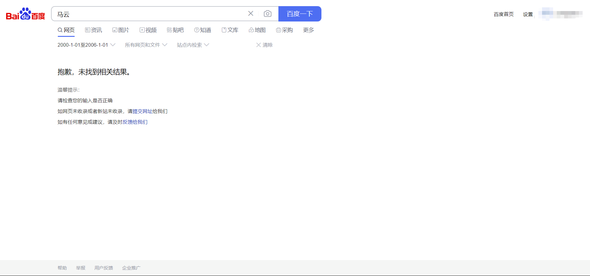
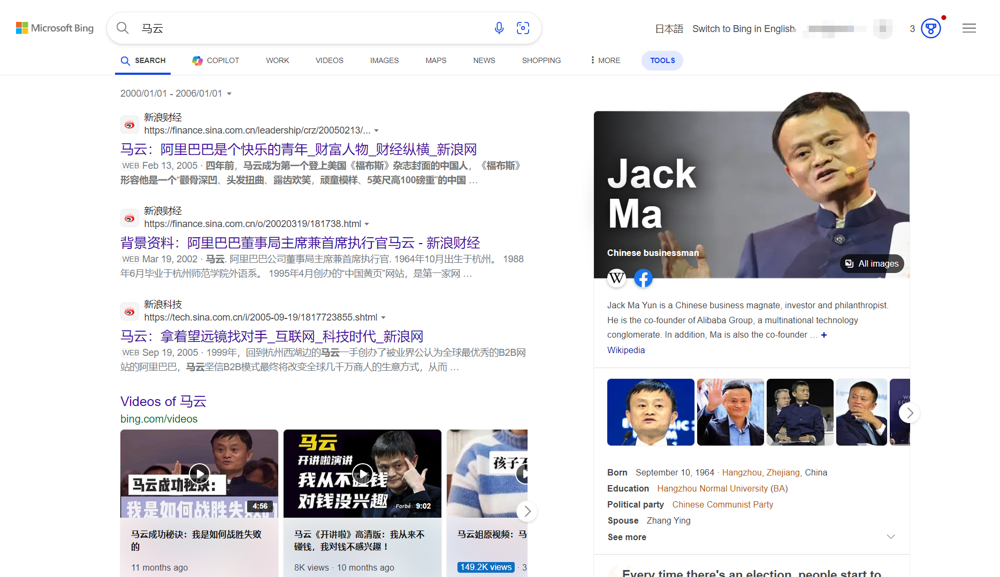
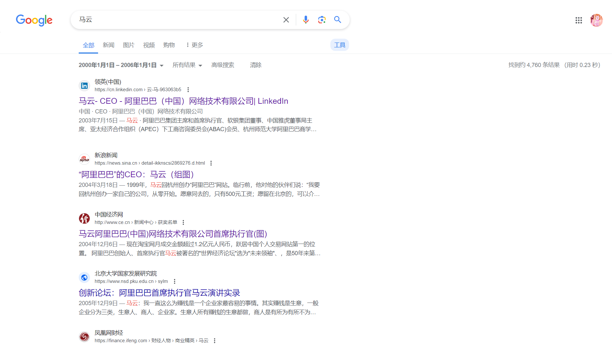

前两天，微信公众号【何加盐】发布了文章《中文互联网正在加速崩塌》，一夜之间在中文互联网刷屏，又一夜之间消失。

我是在这篇文章被删除后才从Twitter上了解到它，从[Archive Today](https://archive.md/HoGem)上阅读了被存档的原文后，觉得作者写得真的深得我心。原文我已经转载在自己的博客上，大家可以[前往阅读](/blogs/chinese-internet-collapse-reprint.html)。

在开始前先批评原文一点。我自以为比较了解互联网的动向，但原文给出的数据让我有些意外。我一直觉得，十几、二十年前一些大公司运营的网站的内容应该还是存在的。事实也印证了我的想法，下面是我于2024年5月25日在百度、Bing（非中国版）、Google搜索关键词“马云”，并限定时间为2000年1月1日至2006年1月1日后得到的结果。

其中，显示结果数的Google声称找到了4760条结果。**可见，情况并没有原作所描述的那样不堪。**至于是原作者编写时测试不够仔细还是为了营销需要，我们不得而知。为了控制变量，我也检查了搜索结果的具体时间，Bing和Google的搜索结果绝大多数也在原作者测试选定的时间范围内。

---

**然而，原作者所表述的观点，却没有任何错误。**

显而易见的，在搜索结果中，几乎只有新浪网和一些较大的媒体的数据，除此之外的内容是缺失的。鉴于媒体一直以来热衷于互相引用的现象，这4760条结果中真正有意义的信息可能也就是47.6条左右。

这也已经足够可怕。

至于这个现象的原因，我基本赞成原作者的观点，此处不再长篇大论。但我想要补充的是，在我们生活的这片土地上，监管原因造成的网站消失情况格外严重。

还记得天涯论坛，虽然当我和同龄人成为互联网的一员时，这个网站已经淡出大众的视野，但是他的停止运营到关闭网站，我们也是亲历者。我记得最初，网站宣布的是停止注册、发贴等而保留阅读以往内容的功能，可是后来不久却选择彻底关闭网站。

这是为什么？曾在我看到一句话：“**没有新的内容需要审核，但是旧的内容需要新的审核**”。

没记错的话这句话应该出自知乎某个与天涯有关的问题下用户的回答，然而我刚刚没能找到这个回答。也许这个回答也像本文在讨论的这篇公众号文章一样消失了，又或许他还在互联网的某个角落，但是难以再被找到。

如果你是一位老网民，还记得大约十年前Google还在中国运营时中文互联网的开放程度，那么我相信你一定能理解这句话的含义；即便不是，你也只需要想一想，是否最近新发生的许多事情成为了禁忌话题，相信也不难体会。

---

原作者没有提到的一点是，在消失之前，内容想要真正进入中文互联网，本身就非常艰难。

首先，是中国的域名备案政策。本文不讨论备案的合理性这一答案不言而喻却没有意义的话题，仅仅考虑它所造成的后果——更少的人愿意去着手搭建一个网站。曾经，我自己的网站为了使用国内服务器而进行了ICP备案，却在正常使用两年多后被网警打电话要求再进行公安备案。最终，我只能选择将所有备案全部注销，成为一个在中国境内访问“非法”的网站。

另一方面，自Google离开之后，百度搜索一家独大进一步恶化了情况。在个人博客没有彻底消失殆尽的时候，一个令人发指的现象在百度搜索上随时发生着：一个人费尽心思在自己的网站上写了一篇文章，发布后某个大博客网站（如CSDN）的用户将原文不声明出处的情况下复制到自己的账号并发出，这个时候，由于这个大网站向百度购买的搜索权重、审核安全性等因素，抄袭的文章将在搜索结果中排得更靠前，而原文甚至可能不会被收录。

事实上，除了一些海外的大公司外，现在百度的搜索结果中鲜有未完成ICP备案和公安备案的网站。换言之，或许你的创作成为了中文互联网的一员，但是它对中文互联网的贡献是零。现在，必应中国版正在接管越来越多的搜索引擎市场份额，上面所说的恶劣情况有所改善，但是对于改变中文互联网而言，已经为时太晚。

这时你也许会说，我本身就不会自己搭建网站，用知乎、抖音这样的平台不是更方便？然而事实是，中文互联网上的这些平台也处于严重的落后状态。

至于原因，其一是无处不在的审核，这一点任何中国人都一定深有体会，不再赘述。

第二是数据的归属权力和持久性。下面是一些简单的事实：使用海外手机号注册的微信支持将微信朋友圈导出为本地文件，绝大多数海外的聊天软件支持将聊天记录导出为文本，推特、Facebook等可以轻松导出自己发布过的所有贴子和评论；反观国内的软件，以上我所提到的这一些都不存在。唯一见过一个提供导出聊天记录的工具是米聊，然而也已经于2021年停止了服务。而问题在于，中文互联网上目前还没有什么持续活跃的网站，如最早霸占市场的百度贴吧，现在用户量也已经直线下降。**谁能知道，下一个十年，抖音、知乎等平台会何去何从呢？**

再者，是中文互联网莫名奇妙的强迫用户下载APP的行为。Twitter至今使用手机浏览器访问的效果还要比客户端更好；而到了CSDN等平台，在浏览器中访问我都需要开启电脑模式来对抗频繁弹出的跳转APP弹窗；知乎更是直接通过浏览器读取已安装应用列表的方式强行跳转；抖音则是在产品做出来很久以后才支持浏览器访问；小红书至今没有Web端……这样的行为，本身就阻碍了互联网内容的自由传播。难以被搜索引擎找到是一；同时在这样的情况下，我会希望阅读的文章范围被局限在了我所熟悉的平台上，潜在的读者严重变少。

---

我还想针对“Web3可以解决这一问题”的观点做一个评论。想到写这一段是因为看到某篇名为《中文互联网崩塌，还剩一个解法》的同样评价这篇公众号的文章（根据搜索到的信息，原文作者为陈根，但我在搜索引擎中没有找到作者发布的一手链接，故此处不提供来源），我们先看看这位作者的观点：

> 但其实之所以会产生这个问题，本质上是因为我们所处的互联网时代，也就是Web2.0时代是中心化的。在中心化的互联网模式下，我们的生活几乎是被中心化的平台或者有关部门操控着的。原本互联网的特点是信息的民主化，每个人都可以自由地生产内容，分享内容，但中心化，意味着我们并不拥有我们所生产的内容，甚至我们所生产的内容反过来还会辖制我们。
>
> 对于中心化的平台或网站来说，保留信息，或者说替我们“记住”，不是它们的义务，平台看中的，只是我们在互联网行动产生的数据——这对于它们是真正有商业价值的东西。……换言之，尽管这篇文章是我创作的，但在平台的中心化模式下，平台利用这些数据获利，而我作为创作者，并未直接从中受益。
>
> 当然，这个问题不是没有解法，事实上，Web3.0的诞生正是为了解决Web2.0这一痼疾。Web3.0的真正核心，就在于数字时代个人数据的主权化。……建立一个对所有用户开放的互联网，在Web3.0中，用户被赋予更大的掌控权，可以拥有并掌控自己的数字身份和数据。甚至这种数字身份与权力完全归属于个人，并且可以随意、自由的参与Web3.0时代的各种网络活动，平台根本就不具备控制权。这与当前的中心化平台模式形成鲜明对比，后者通常通过掌握大量用户数据，以及剥夺用户的数据权力来实现垄断，并从中获得超额回报。而Web3.0的理念旨在打破这种垄断格局，使用户能够更直接地从自己的数据中受益，这与传统商业收益模型截然不同。
>
> 从某个层面而言，这也是解决中文互联网崩塌的唯一解法——用技术的发展解决技术的局限性，为人类文明带来福祉，这也正是科技发展的规律和意义。

（事实上该作者对Web3.0的定义有些过于片面，但鉴于这不是本文所要讨论的核心，此处不做纠正）

引用的这部分中最后一句话说得固然不错，然而这样的想法实在有些过于理想化。

其实互联网创立的初衷很简单：简化信息的传递并提高效率。我们反而应该问问自己：是谁告诉我们，互联网是一个存储信息的优良港湾？

**也许这一想法，从根本上就是错误的。**

纵然现在存储设备正飞速发展，数据的存储成本也在降低，然而随着数据总量的飞速成长，一个人能存储下来整个互联网内容的日子还是遥遥无期，甚至越来越远。那么，即便我们迎来了去中心化、人人作为互联网运营者一员的互联网世界，又能怎样呢？

就目前来看，即便到了Web4.0，5.0，6.0……维持全球互联网的，还会是那么几根岌岌可危的海底光缆。大如中国，如果互联网流量要出境，也必须经过北京、上海、广州三个互联网出口之一。一个普通的水下作业都可能失误破坏光缆，更不用提战争、政治需要等等因素。也许你要谈星链，那么很抱歉，我们又回到了有中心化的世界。

---

我在一年多前就开发了一个可以私有部署的网页存档工具：[网页存档 Archive Api](https://github.com/yxzlwz/archive-api)。如果没有更好的办法，每个人努力保留自己的互联网记忆，便是这个时代最好的方式。

最后，希望这篇文章不会消失在中文互联网之中。
