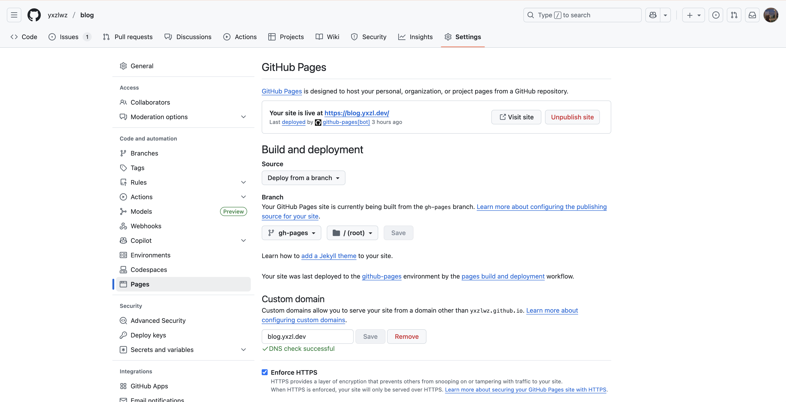

高考前的大半年停止了开发之后，终于在昨天由于大学生活的无聊准备重新捡起。饱受部署的各种问题折磨的我这次准备直接使用 GitHub。

（其实主要是来到了上海纽约大学之后不用再考虑翻墙的问题了）

另外，我还启用了新域名 yxzl.dev

## 配置 GitHub Actions

第一步是通过 GitHub 的工作流来打包项目。

下面是 vuepress-theme-hope 给出的配置文件，对于任何 VuePress 项目应该都适用：

```yaml
name: 部署文档

on:
  push:
    branches:
      - main

permissions:
  contents: write

jobs:
  deploy-gh-pages:
    runs-on: ubuntu-latest
    steps:
      - name: Checkout
        uses: actions/checkout@v4
        with:
          fetch-depth: 0
          # 如果你文档需要 Git 子模块，取消注释下一行
          # submodules: true

      - name: 设置 pnpm
        uses: pnpm/action-setup@v4
        with:
          version: 10

      - name: 设置 Node.js
        uses: actions/setup-node@v4
        with:
          node-version: 22
          cache: pnpm

      - name: 安装依赖
        run: |
          corepack enable
          pnpm install --frozen-lockfile

      - name: 构建文档
        env:
          NODE_OPTIONS: --max_old_space_size=8192
        run: |-
          pnpm run build
          > src/.vuepress/dist/.nojekyll

      - name: 部署文档
        uses: JamesIves/github-pages-deploy-action@v4
        with:
          # 部署文档
          branch: gh-pages
          folder: src/.vuepress/dist
```

这个 action 会在每次 push 到 main 分支时触发，打包 VuePress 项目并将生成的静态文件推送到 `gh-pages` 分支。

使用时需要注意修改以下内容：

- `branches`：如果你的主分支不是 `main`，需要修改为你的主分支名称。
- 根据你的项目需要选择 node 和 pnpm 版本。如果你不使用 pnpm，删除相关内容即可。
- `folder`：许多情况下，源文件目录可能不是 `src`，而是 `docs` 或 `blog` 等等。

## 配置 GitHub Pages

> 此处不得不说 GitHub Pages 的文档写得一言难尽，甚至没说明白如何配置自定义域名的 CNAME 记录。

如果需要使用自定义域名，建议先对想要使用的域名设置 CNAME 解析，指向 `your-github-username.github.io`。

然后，在 GitHub 仓库的设置中，找到 "Pages" 选项卡。

Branch 应选择上一步生成的 `gh-pages` 分支，目录选择根目录 `/ (root)`。

如果需要自定义域名，可同时在此界面中填写。

GitHub 可在验证完成 DNS 记录后为自定义域名自动生成 SSL 证书，这一步骤通常很快，但初次添加时仍有可能卡住几个小时。目前没有已知的有效方案，只能等待。如果长时间未能成功验证DNS信息，可以尝试删除自定义域名后重新添加。



## 重新部署后自定义域名失效

GitHub 存储自定义域名的方法是在选定的 Git 分支的根目录下放置一个名为 `CNAME` 的文件，文件内容为自定义域名。

而在上述设置中，每次重新部署时，GitHub Actions 会将 `gh-pages` 分支的内容替换为最新生成的静态文件，同时删除 `CNAME` 文件。

要在每次部署后保留该文件，最简单的方法是在 `.vuepress/public` 目录下手动创建 `CNAME` 文件，具体内容可以自行查看 GitHub 在 `gh-pages` 中自动生成的文件。
