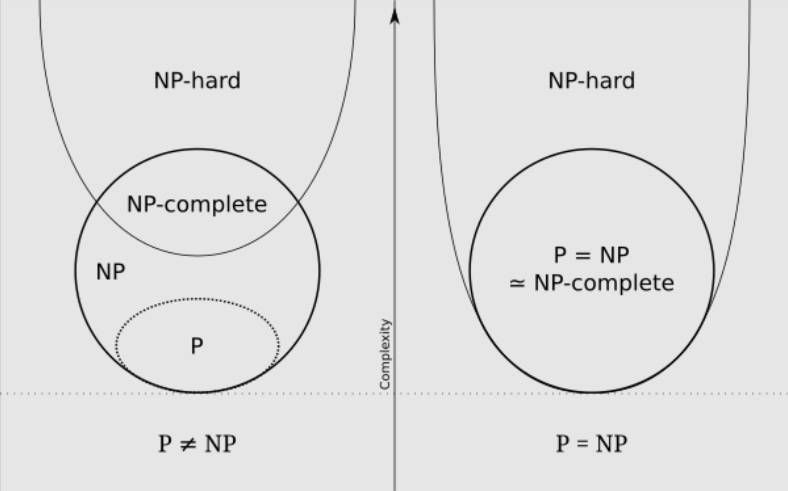

## P 问题（Polynomial Problem）

P 是在复杂度类问题中可于确定型图灵机以多项式量级（或称多项式时间）求解的==决定性问题==。

::: note 决定性问题
输出只有“是”或“否”的问题。
:::

换句话说，P 是指可以通过复杂度为 $O(n^k)$ 的算法解决的问题（其中 $k$ 为常数）。

举个简单的例子，查找一个长度为 $n$ 的列表中是否存在元素 $m$ 就是一个 P 问题，该例中朴素算法的复杂度为 $O(n)$

## NP 问题（Nondeterministic Polynomial Problem）

NP 问题包含可在多项式时间内验证其解是否正确，但不保证能在多项式时间内能找出解的==决定性问题==。

这个问题的例子如下：给定一个有 $n$ 个整数的集合 $S$，问是否存在一个 $S$ 的非空子集 $S_0$，使得 $S_0$ 中所有元素相加的结果为 $0$ ？

对于这一个问题：

- 不保证能在多项式时间内求解：枚举的时间复杂度为 $O(2^n)$
- 可在多项式时间内验证其解是否正确：对于任意一个子集，执行一次复杂度不超过 $O(n)$ 的累加即可验证该子集是否符合条件

## P = NP 问题

即便根据上方的定义，大部分人的直觉都是 P 问题是 NP 问题的子集。然而也有科学家认为，P 问题和 NP 问题本质上是相同的。

简单来说，P = NP 即：若问题的答案可以在多项式时间内验证，其答案是否也可以在多项式时间内被计算出来。

## NP-complete 和 NP-hard

在看这两个概念之前，我们先来了解一下 P、NP、NP-complete 和 NP-hard 之间的关系。根据命题 P = NP 的成立与否，我们可以画出如下左右两种关系图（请重点关注左侧部分）：

### NP-complete

又称 NP 完全或 NP 完备。NP- complete 是 NP 中最难的决定性问题，所有 NP 问题都可以在多项式时间内被==归约==为 NP 完全问题。

::: note 归约
将某个计算问题变换为另一个问题的过程。针对两个问题 $A$ 和 $B$ ，如果存在一个 $O(n^k)$ 时间的（决定性）算法，将每一个问题 $A$ 的输入转换成问题 $B$ 的输入，使得问题 $A$ 有解时，当且仅当，问题 $B$ 有解。
:::

NP-complete 是 NP 和 NP-hard 的交集。

### NP-hard

如果所有 NP 问题都可以多项式时间==归约==到某个问题，则称该问题为 NP 困难。

特别说明的是，与 P 和 NP 的定义不同，NP-hard 的定义==不要求==该问题是一个决定性问题。

NP-hard 最经典的例子是旅行商问题的最短路径长度。

我们先来看旅行商问题的决策版本：给定一系列城市和每对城市之间的距离，求解是否存在一个回路，该回路访问每座城市一次并回到起始城市（即哈密顿路径），并且该回路==总长度小于 $k$== ？

这个问题是一个 NP 问题：

- 如果有人给你一条路径作为解，你可以在多项式时间内检查它是否是回路、是否经过所有城市，以及它的总长度是否 $≤k$
- 我们无法在多项式时间内枚举所有回路，因此不保证能在多项式时间内回答此问题

事实上，这一问题也是 ==NP-complete 问题==，由于证明难度过大，此处不做证明。

在决策版问题的基础上，如果我们将题目要求更改为找出满足该条件的==总长度最小的回路==，则得到了旅行商问题的优化版。

优化版问题是一个 NP-hard 问题：

- 无法在多项式时间内验证：尽管我们可以验证某个长度的回路存在，但要确定该回路总长度最小，还是需要遍历所有可能性，这在多项式时间内无解
- 决策版问题可以归约为优化版问题：
  - 决策版问题的输入是图 $G$ 和整数 $k$ ，优化版问题的输入是图 $G$
  - 决策版问题输出“是”或“否”，优化版问题输出哈密顿路径的最小长度 $k_{min}$
  - 要解决决策版问题，我们只需要解决优化版问题得到 $k_{min}$ ，再将 $k_{min}$ 与 $k$ 比较即可
  - 因此，可以通过解决优化版问题来解决决策版本问题。
  - 又因为旅行商问题决策版本是 NP-complete 问题，借助 NP-complete 定义，一切 NP 问题都能归约到旅行商问题的优化版本，因此旅行商问题的优化版本是 NP-hard 问题

## 注

部分内容引用自维基百科。
