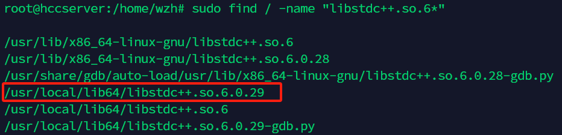
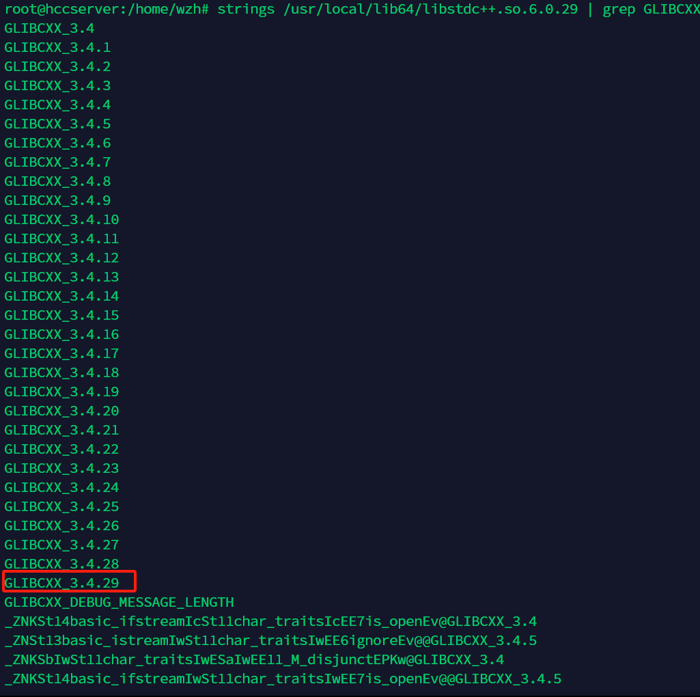

本文部分转载自CSDN文章：<https://blog.csdn.net/weixin_39379635/article/details/129159713>。由于原作者的系统环境严重受到Anaconda污染，发布时对原文代码、截图等做了改动与补充。

特别提醒：**本文方法涉及到系统链接库的修改，可能会对系统稳定性造成影响。**

本文方法仅在Debian 10测试通过。

---

首先，运行时出现的问题如下：

```
ImportError: /lib/x86_64-linux-gnu/libstdc++.so.6: version `GLIBCXX_3.4.29' not found (required by ...)
```

这个是默认路径下的`libstdc++.so.6`缺少`GLIBCXX_3.4.29`，解决方法如下所示。

首先使用指令先看下系统目前都有哪些版本的：

```bash
strings /usr/lib/x86_64-linux-gnu/libstdc++.so.6 | grep GLIBCXX
```

我这里只到3.28，所以确定是缺少GLIBCXX_3.4.29。

此时我们的系统中很可能有相关文件，并不需要进行下载、更新等操作，只需要启用更高版本的即可。

来查看当前系统中其它的同类型文件，找到一个版本比较高的：

```bash
sudo find / -name "libstdc++.so.6*"
```

这一条命令的运行时间较长，约1-2min，请耐心等待。

我这里的运行结果如下：



版本比较多，就选了一个版本较高的，我这里是3.4.29，使用之前的指令看看其是否包含需要的版本：

```bash
strings /usr/local/lib64/libstdc++.so.6.0.29 | grep GLIBCXX
```



这条命令在我这里的输出极长，不过没有关系，我们只需要在开始的位置找到如图所示的这一个即可。

如果你运行命令后没有看到类似的输出，那么很抱歉，你可能需要换一个方式解决问题了；如果你和我一样，那么接下来就是建立新的链接到这个文件上：

```bash
# 复制
sudo cp /usr/local/lib64/libstdc++.so.6.0.29 /usr/lib/x86_64-linux-gnu/
# 删除旧的链接
sudo rm /usr/lib/x86_64-linux-gnu/libstdc++.so.6
# 创建新的链接
sudo ln -s /usr/lib/x86_64-linux-gnu/libstdc++.so.6.0.29 /usr/lib/x86_64-linux-gnu/libstdc++.so.6
```

运行时记得替换文件路径。至此我们的问题就得到解决了！
