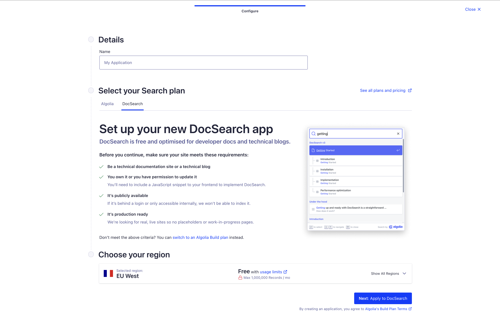
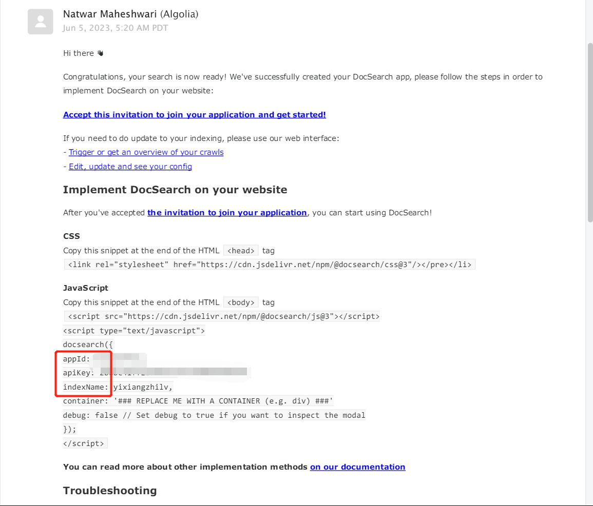
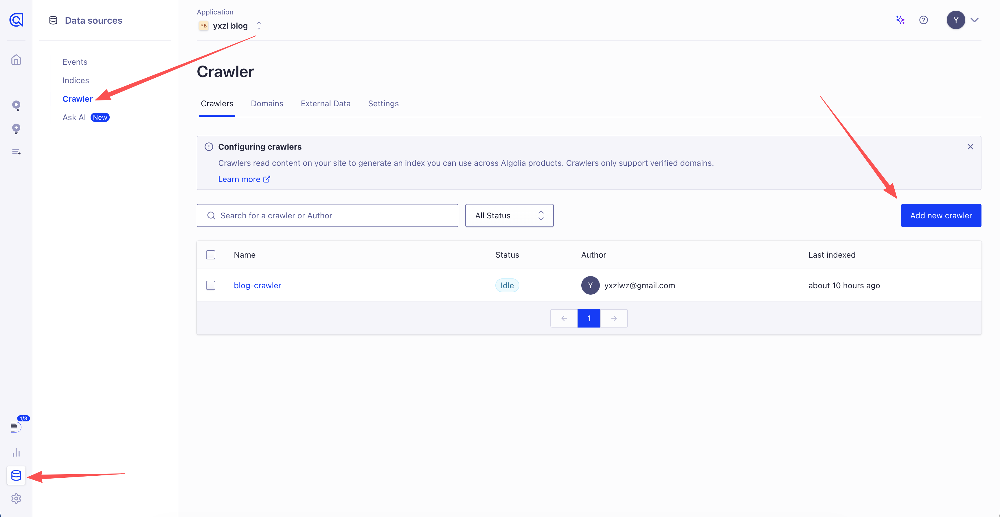
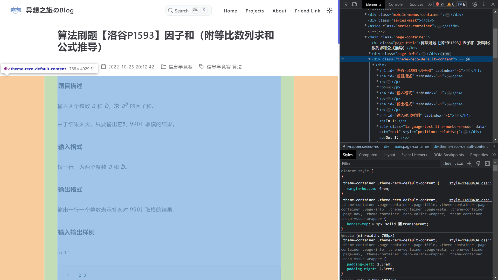
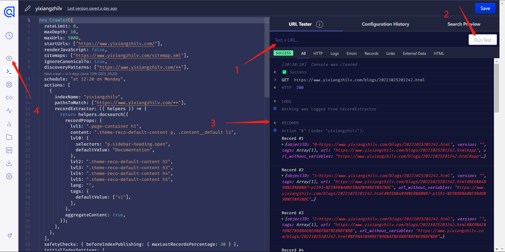
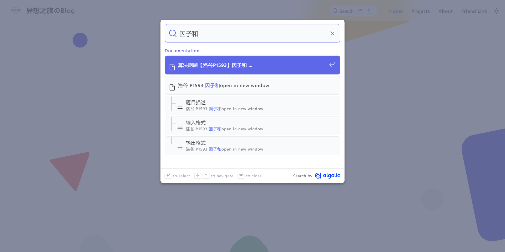

我曾在2023年6月7日写过一篇介绍 Vuepress 中 Algolia 配置的[文章](/article/379iguya/)。前两天，当我换了新域名 yxzl.dev 之后，想要再遵循这一流程居然失败了。经过一系列折腾，写出了下面这篇新文章。

## 创建应用

首先访问 [DocSearch 主页](https://docsearch.algolia.com/)，在此页面点击“Sign Up”，经过一系列注册和登录操作后，你应该能看到如下界面：



随便起一个名字，然后点击下一步即可。创建过程可能会略有点慢，创建成功后页面会自动重定向。我曾遇到地区选择美国东部卡死在创建流程的情况，换到西欧就正常了。

下一步是添加域名，添加域名后需要进行审核（通常很快）；与此同时，你还需要验证域名所有权，绝大多数情况下可以通过 DNS TXT 解析，但我也有遇到这一方法始终验证不通过的情况，此时用 HTML 验证即可（可以通过 GitHub Pages 完成）。

## 获取API信息

访问 <https://dashboard.algolia.com/account/api-keys> 即可查看应用的 appId（Application ID）和 apiKey（Search API Key），这两项通常是 Vuepress 项目配置必要的。

在官方发来的邮件中，提取出 `appId` `apiKey` 和 `indexName` 三个信息，然后根据自己使用的 Vuepress 框架的文档进行配置即可。



配置完成后，请尝试搜索一个关键词（确保你的网站中有文档包含这一关键词），如果正常返回了搜索结果，那么恭喜你已经完成了配置；如果你和我一样，搜什么都是 No Results，那么请继续往下看。

## 创建和配置爬虫

在控制台中，点击左下角的 Data Sources 按钮，再点击 Crawler，即可添加或管理爬虫。




点击创建好的爬虫，进入配置界面，在左侧菜单中点击 Editor，会进入一个代码编辑界面。代码很长，我们只关心前面的这一部分：

```js
new Crawler({
  appId: "6T04KIYWWA",
  indexPrefix: "",
  rateLimit: 8,
  maxDepth: 10,
  maxUrls: null,  // [!code highlight]
  schedule: "on monday",  // [!code highlight]
  startUrls: ["https://blog.yxzl.dev"],  // [!code highlight]
  renderJavaScript: false,
  sitemaps: ["https://blog.yxzl.dev/sitemap.xml"],  // [!code highlight]
  ignoreCanonicalTo: true,
  actions: [
    {
      indexName: "blog-crawler",  // [!code highlight]
      pathsToMatch: ["https://blog.yxzl.dev/**"],  // [!code highlight]
      recordExtractor: ({ helpers }) => {
        return helpers.docsearch({
          recordProps: {
            lvl1: ".page-container h1",  // [!code highlight]
            content: ".page-container p",  // [!code highlight]
            lvl0: {
              selectors: "p.sidebar-heading.open",
              defaultValue: "Documentation",
            },
            lvl2: ".page-container h2",  // [!code highlight]
            lvl3: ".page-container h3",  // [!code highlight]
            lvl4: ".page-container h4",  // [!code highlight]
            lvl5: ".page-container h5",  // [!code highlight]
            lang: "",
            tags: {
              defaultValue: ["v1"],
            },
          },
          aggregateContent: true,
        });
      },
    },
  ],
...
```

代码中高亮的即为我们需要修改的部分：

- `maxUrls`：初始值通常是一个较小的数字，供测试使用，测试结束后应配置为 `null`
- `schedule`：Algolia 爬取你网站的频次。这一数值可以在网站中的 Configuration 界面使用图形化工具修改。
- `startUrls`：爬虫爬取的入口，通常配置为网站首页即可
- `sitemaps`：网站地图的链接，没有可以设置为空数组。Vuepress 现在提供了非常简单的方式生成站点地图，建议大家进行配置。
- `indexName`：默认值与爬虫名称相同，通常情况下无需进行修改。这个值也需要写到 Vuepress 的配置文件中。
- `oathsToMatch`：哪些格式的链接会被爬取，无特殊需求照抄我这样的格式即可。
- `recordProps` 中的内容：这些参数配置爬虫如何从你的界面中找到各级标题和正文。对于大多数 Vuepress 站点，应该可以直接照抄上方配置（下文会给出测试方法，如果测试不通过你再修改也来得及）

::: details 如何找到 recordProps 应配置的值

以 vuepress-theme-reco 主题为例，打开任意文章后，使用浏览器检查工具，我们可以看到所有内容都被包裹在 `.theme-reco-default-content` 中：



此时就可以把上面配置中的所有 `.page-container` 替换为 `.theme-reco-default-content`。

:::

修改好后，在网站右侧的 URL Tester 中可以输入自己网站某个界面的网址进行测试（注意选择正文界面而非首页，毕竟首页并没有东西用来建索引），如果看到 Records 中有内容就是成功啦。



此时先别着急离开，**一定要点击右下角的 Publish 按钮**，内容才会保存。

在此之后点击上图中 4 标注的小眼睛回到 Overview 界面，点击右上角的按钮重新启动爬虫，然后耐心等待爬取完成就可以啦！


