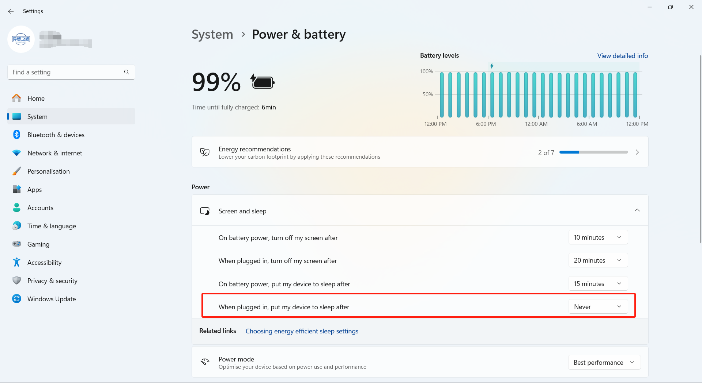
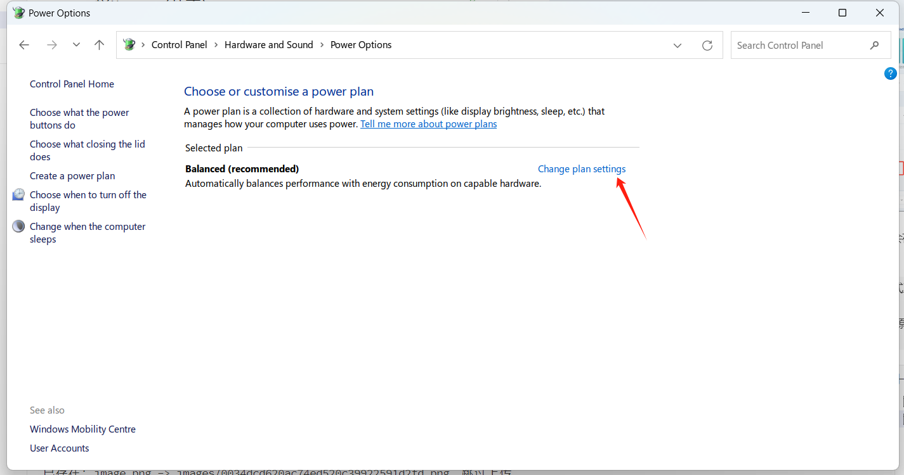
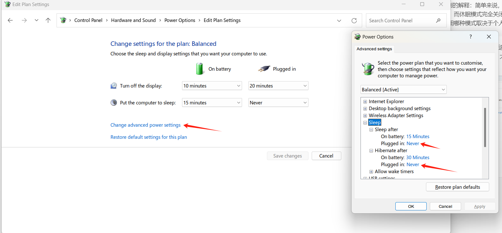

> 写作背景：我希望把我的电脑放在家里一直通电，以保证我在外面能够连接远程桌面，然而我发现即便我在设置中关闭了自动睡眠，电脑也会自动休眠。

如图，正常的操作是在Windows设置中更改电脑在无操作时关闭屏幕和进入睡眠的时间。若要保证电脑的远程桌面随时可用，这里的插电时自动睡眠时间应选择Never（从不）。

然而，如果你的电脑支持休眠，那么还有一个“自动进入休眠”的选项不会在Windows设置中显示，需要前往控制面板修改。

> ChatGPT对于睡眠和休眠区别的解释：简单来说，睡眠模式比休眠模式更快速启动，但消耗一定的电力；而休眠模式完全关闭电源，不消耗电力，但启动时需要较长时间。选择使用哪种模式取决于个人的使用习惯和对电源管理的需求。

打开控制面板，选择“系统和安全”，然后选择“电源选项”，在打开的界面中点击Change plan settings（由于我的电脑是英文系统，大家根据大致翻译和按钮位置对应即可）

在打开的界面中，我们可以看到和Windows设置中一样的4个选项。紧接着点击Change advanced power settings（凭我的印象，这个选项的中文名应该是“更改高级电源选项”），在打开的窗口中找到睡眠，并将插电时的自动睡眠和自动休眠全部设置为Never（此处不会为你提供这个选项，你只需要输入数字0，点击确定后Windows会自动处理）

---

碎碎念：现在的 Windows 真的是一个巨大的缝合怪，Windows 11 各种官方软件的 UI 设计都严重不统一，更别提大家期待的 Windows 设置完美替代控制面板了。
