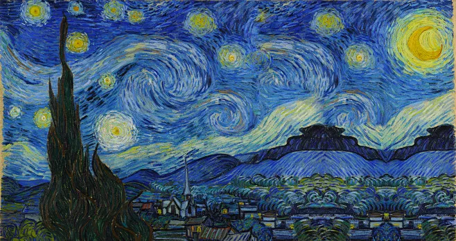
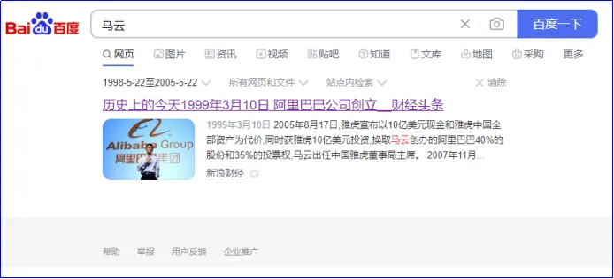
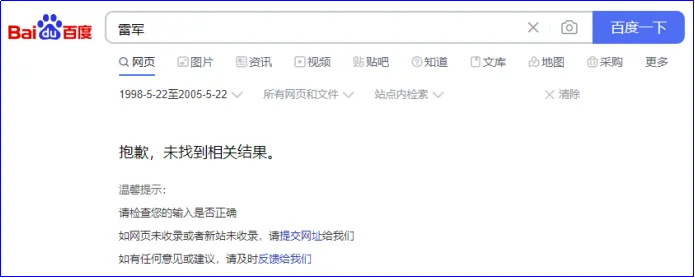
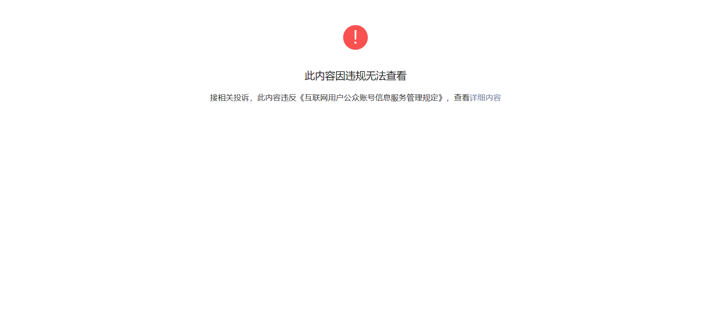

::: warning
The content was translated from the Chinese version by Generative AI. Please double-check the content.
:::

---

## 1

Let me start with a small question:

If we search for the two characters "马云" (Jack Ma) on Baidu, setting the time range to 1998 to 2005, roughly how many results would we get? 100 million? 10 million? Or 1 million?

I’ve asked in several groups, and people generally guess it should be in the millions or tens of millions. After all, internet information is so vast. As a prominent entrepreneur of that era, Jack Ma must have left plenty of traces online.

But the actual total results are as follows:

Searching Baidu with the date range "May 22, 1998 to May 22, 2005" for content containing "马云" yields a total of 1 result (data as of May 22, 2024).

And this sole result is also false. Clicking in reveals the article was actually published in 2021, outside the specified time range, yet somehow mistakenly included in the search results.

In other words, if we want to learn about Jack Ma’s experiences, media coverage, public discussions, speeches, or his company’s development during that period, the amount of valid original information we can obtain is zero.

You might think, "Is this a Baidu issue? Would Bing or Google yield better results?"

I tested them, and the valid information from these two sites is not significantly different from Baidu—slightly more, but still only a handful. Most results are also time-disordered and invalid, erroneously crawled for unknown technical reasons.

You might also wonder, "Could it be because Jack Ma is controversial, and for some unspeakable reason, his information is unavailable?"

But in reality, this isn’t unique to Jack Ma. Searching for Pony Ma, Lei Jun, Ren Zhengfei, even internet celebrities like Luo Yonghao and Sister Lotus who were popular back then, or stars like Jay Chou and Li Yuchun who once dominated the web, yields the same result. For example, searching for Lei Jun shows:

After testing different websites, names, and time periods, I discovered a shocking phenomenon:

Almost all once-popular Chinese websites from that era—NetEase, Sohu, campus BBS, Xici Hutong, Kaidi Maoyan, Tianya Forum, Xiaonei (Renren), Sina Blog, Baidu Tieba, and countless personal websites—have completely lost their content from before a certain year. Many have even lost all content from all years. The only exception is Sina, which still has a few scattered pieces of information from over a decade ago, but these are negligible; over 99.9999% of content has vanished.

No one has realized a serious problem: **The Chinese internet is collapsing rapidly. Content from the Chinese internet before the mobile internet era has almost disappeared entirely.**

We once thought the internet had a memory, but we never imagined it would be as fleeting as a goldfish’s.

## 2

I noticed this issue because the He Jiayan public account focuses on studying remarkable people, requiring me to frequently research their backgrounds.

Over the past two years, I’ve had an increasingly clear feeling: the original information available online is plummeting annually. Reports that once existed gradually vanish; speeches or articles by subjects disappear; interview or dialogue videos fade away.

**It’s as if there’s a webpage-devouring monster, crawling along the timeline from the past to the present—first nibbling, then gulping—swallowing all Chinese internet content in five- or ten-year chunks.**

By the time we realize it, everything from the pre-mobile internet Chinese internet—whether portals, official websites, personal pages, campus BBS, public forums, Sina Blogs, Baidu Tieba, or files, photos, music, videos—will have vanished.

I remember over a decade ago, when I replaced my computer, I compressed photos and articles into a zip file and stored it on a BBS. A few years later, that entire BBS was gone. I once used a Hotmail account with many precious emails—all lost. I wrote on Renren and MySpace—both now gone.

**We once believed the internet could preserve everything, yet nothing has been preserved.**

This reminds me of the "Dual Vector Foil" from Liu Cixin’s *The Three-Body Problem*. The Singer Civilization, detecting intelligent life in the Solar System, instinctively hurls a Dual Vector Foil to eliminate it. The Solar System then collapses from three dimensions to two at the speed of light, transforming into a Van-Gogh-like "Starry Night" painting. All traces of life and civilization vanish forever.

On the internet, we’re already being devoured by such a foil—a "temporal Dual Vector Foil," consuming the dimension of time.

After the Solar System was flattened by the Singer Civilization’s Dual Vector Foil, at least it left behind a "Starry Night." But when the internet is devoured by the temporal Dual Vector Foil, only emptiness remains.

## 3

Why is this happening? I suspect two main reasons:

First, economic factors.

Websites require servers, bandwidth, data centers, maintenance personnel, and various regulatory compliance costs—all expenses. If a site has strategic value (e.g., displaying desired corporate information) or short-term traffic value (e.g., consistent visitor numbers), and the company has sufficient funds, there’s incentive to maintain it.

But if a company stumbles commercially and runs out of money, the entire website dies. Renren is a typical example.

Even if a company has funds, from an operational perspective, a webpage with negligible annual clicks becomes a burden. The economically rational choice is to shut it down. The loss of early content on Sohu/NetEase and the collapse of BBS platforms like Tianya Forum stem from this.

Second, regulatory factors.

In general, internet regulation has evolved from nonexistent to strict, then stricter. Content once legally permissible may later violate regulations; what was once gray-area content may be reclassified as illegal—all subject to removal.

Additionally, as public opinion polarizes, content once considered "ordinary" may become sensitive or provocative in later contexts. Even if not illegal, it may be removed to prevent conflict.

Beyond official regulators, outraged netizens often act as informal censors, digging up decade-old comments to "cancel" individuals through online mobbing.

But the biggest regulatory impact isn’t direct removal or public outrage—it’s self-censorship by companies and individuals.

No one knows if a past webpage or comment might trigger disaster years later. The safest option is to eliminate these potential "time bombs" by shutting down sites or deleting content.

Beyond these two reasons, other factors exist:

For instance, after Yugoslavia’s dissolution, all content under the ".yu" domain vanished. Strengthened copyright protection wiped out once-ubiquitous music and movie download sites. Some institutions or individuals simply disable official sites or personal pages when no longer wanting to share information.

But these are secondary and localized. The systematic, large-scale disappearance of internet content stems primarily from economic logic and self-censorship.

**Essentially, internet content, like life, is governed by evolution. Its survival depends on one criterion: capturing as much attention as possible at the lowest cost.**

If content can attract sufficient attention relative to its maintenance costs (including economic, regulatory, and anti-regulatory costs), it may survive—though it might shift forms: text to images, static to dynamic, video to 3D holograms. Platforms also evolve: from portals to BBS, blogs, microblogs, WeChat, Douyin, and beyond.

Content failing to attract attention or incurring excessive costs vanishes. The collective demise of pre-mobile internet content is merely the inevitable result of this "information evolution competition."

Biological evolution follows "natural selection, survival of the fittest"; internet content evolves through "information competition, attention selection, survival of the fittest." Due to network effects, this competition is a million times fiercer and crueler than nature. The pre-mobile internet isn’t facing extinction of a single species, but near-total annihilation of all content.

With each new internet era, the old one collapses. The temporal Dual Vector Foil is the inescapable fate of all websites and content.

## 4

If future civilization is internet-based, our generation will be historyless—for the internet holds no trace of us.

Does "having no history" matter?

Absolutely.

While writing about Shao Yibo, I exhaustively searched for the original 2007 *Boss Town* interview video and years of posts by his wife Bao Jiaxin under the username "Wen'ai Mami" on Babytree Community. I failed, leaving me deeply regretful.

Though my article *Shao Yibo Forgotten by the Mortal World* was well-received—700,000 reads and 20,000 shares in a week—I’m certain I missed critical information. Including it would have improved the piece, but its absence left it imperfect.

You might think, "This only matters to researchers like He Jiayan. I don’t write such articles; losing internet info doesn’t affect me."

Is that true?

Wouldn’t you regret losing all of Jack Ma’s speeches, Ren Zhengfei’s essays like *My Father and Mother* and *A River of Spring Water Flows East*, or Duan Yongping’s posts on Snowball?

If you say no…

What about losing Huang Zheng’s official account, Zhang Yiming’s Weibo, or Wang Xing’s Fanfou? Still no regret?

What if Zhihu vanishes like Tianya, Douban disappears like Renren, or Bilibili fades into obscurity like Sina Blog? Would that sting?

What if your favorite Weibo blogger only shows "Author only displays posts from the past six months; this post is unavailable," your go-to official accounts shows "Account blocked; content inaccessible," or searching Douyin/Xiaohongshu yields "Author has cleared all content"?

What if Weibo, WeChat Official Accounts, Douyin, and Xiaohongshu all perish like BBS, Tieba, Qzone, and blogs before them?

Would you grieve for even a minute?

As a generation of the traditional internet, those born in the 70s and 80s can never reclaim our history—it’s already gone.

Younger generations might still have Moments, but more set "visible for three days" and stay silent.

The only active Moments posts are marketing spam—soon to vanish too.

## 5

If something important is disappearing, can we save it?

Attempts have been made. The U.S.-based "Internet Archive" preserves many original webpages, but its Chinese content is sparse, search functions are primitive and inefficient—effectively useless.

Technically, preserving all webpages from China’s internet inception to the mobile era would be feasible and low-cost. Compared to today’s video-dominated internet, those early text-image pages occupy negligible storage.

The question is: Who would do this, and why?

Businesses won’t—no profit motive.

Governments might establish a webpage archive like libraries or museums, but why invest in it? Beyond preserving history, there’s little incentive. Even if created, access would likely require permissions to prevent misuse, rendering it irrelevant to average users.

Moreover, it’s already too late. Post-mobile internet, traditional Chinese internet content has nearly vanished—over 99%, by rough estimate.

In a sense, He Jiayan’s "remarkable people" articles contribute marginally to preserving this history. Without them, much would be lost online—but these are curated secondary sources, not originals.

Today, nearly all information online about major events and celebrities from the 2000s is second-hand or distorted Nth-hand content from self-media.

Original reports, videos, speeches, eyewitness accounts, and comments—all gone.

In time, even these secondary sources will disappear, as if those events and people never existed.

We’re powerless to reverse this.

In the future internet era, looking back at the first two decades of the 21st century will reveal a historical void.

We are the generation erased by the internet.

If you still encounter fragments of early Chinese internet content, it’s merely the last glow of a setting sun.

Understanding its transience, you might echo Faust’s last words: *"Verweile doch, du bist so schön!"* (Stay a while, you are so beautiful!)

But that glow, like your exclamation, will soon be swallowed by the temporal Dual Vector Foil, leaving only emptiness.

In *The Three-Body Problem*, Cheng Xin and Ai AA escaped the flattening of the Solar System via a curvature-driven ship.

We have no such ship.

No escape.

Nearly everything you see and create today—including this article and platform—will eventually drown in emptiness.

---

Screenshot of the original article:

The content of this article is directly sourced from Archive Today: <https://archive.md/HoGem>.
