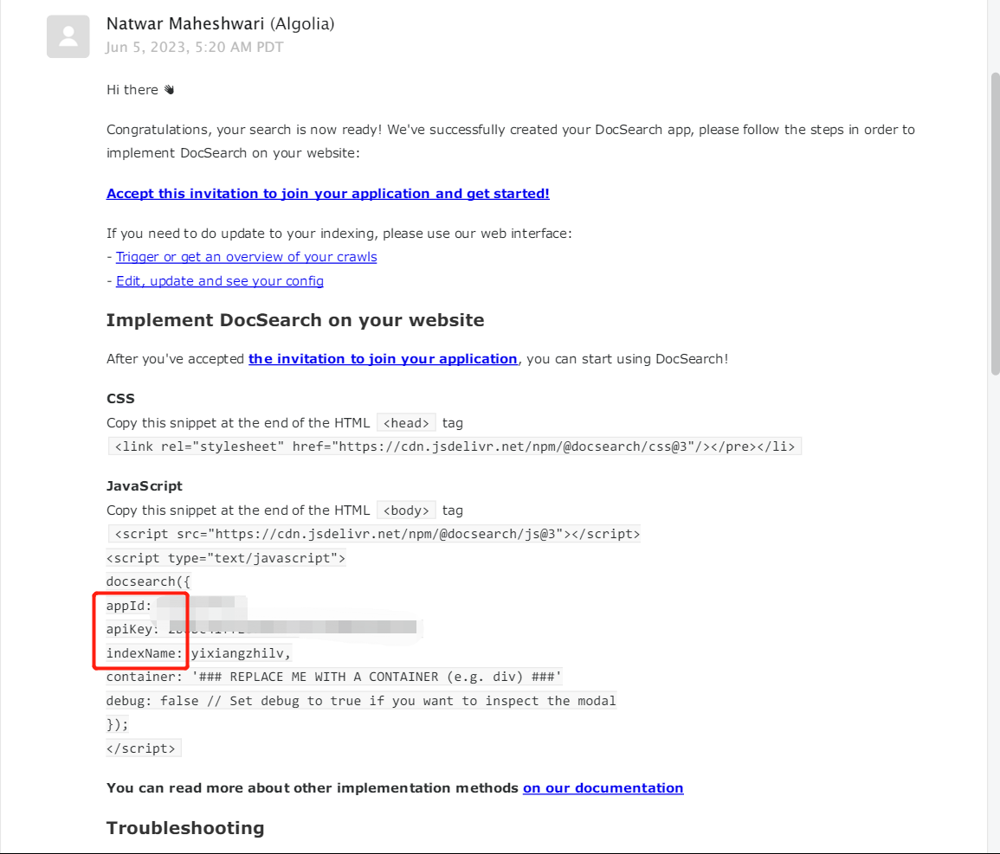
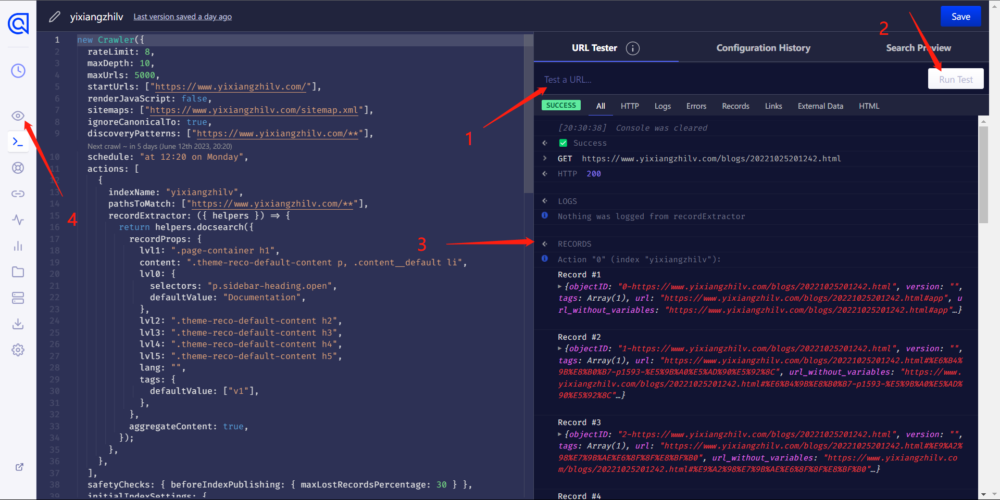

::: warning
The content was translated from the Chinese version by Generative AI. Please double-check the content.
:::

I once wrote an article introducing Algolia configuration in Vuepress on June 7, 2023 ([article](/article/379iguya/)). A couple of days ago, after changing to a new domain yxzl.dev, I surprisingly failed when trying to follow the same process again. After going through a series of troubles, I wrote the following new article.

## Creating an Application

First, visit the [DocSearch homepage](https://docsearch.algolia.com/), click "Sign Up" on this page, and after a series of registration and login steps, you should see the following interface:


Choose a random name, then click Next. The creation process might be a bit slow, and after successful creation, the page will automatically redirect. I once encountered a situation where selecting the US East region got stuck in the creation process, but switching to Western Europe worked normally.

The next step is to add a domain. After adding the domain, it needs to be reviewed (usually quickly); at the same time, you also need to verify domain ownership. In most cases, this can be done through DNS TXT record resolution, but I have also encountered situations where this method始终验证不通过 (this method always fails to verify), in which case HTML verification can be used (which can be done via GitHub Pages).

## Obtaining API Information

Visit <https://dashboard.algolia.com/account/api-keys> to view the app's appId (Application ID) and apiKey (Search API Key), which are usually necessary for Vuepress project configuration.

In the official email sent to you, extract the three pieces of information: `appId`, `apiKey`, and `indexName`, then configure according to the documentation of the Vuepress framework you are using.



After configuration, try searching for a keyword (make sure there is a document on your website containing this keyword). If search results are returned normally, congratulations, you have completed the configuration; if, like me, you get "No Results" for any search, then please continue reading.

## Creating and Configuring the Crawler

In the console, click the Data Sources button in the bottom left corner, then click Crawler to add or manage crawlers.


Click on the created crawler to enter the configuration interface, then click Editor in the left menu to enter a code editing interface. The code is long; we only care about the following part:

```js
new Crawler({
  appId: "6T04KIYWWA",
  indexPrefix: "",
  rateLimit: 8,
  maxDepth: 10,
  maxUrls: null,  // [!code highlight]
  schedule: "on monday",  // [!code highlight]
  startUrls: ["https://blog.yxzl.dev"],  // [!code highlight]
  renderJavaScript: false,
  sitemaps: ["https://blog.yxzl.dev/sitemap.xml"],  // [!code highlight]
  ignoreCanonicalTo: true,
  actions: [
    {
      indexName: "blog-crawler",  // [!code highlight]
      pathsToMatch: ["https://blog.yxzl.dev/**"],  // [!code highlight]
      recordExtractor: ({ helpers }) => {
        return helpers.docsearch({
          recordProps: {
            lvl1: ".page-container h1",  // [!code highlight]
            content: ".page-container p",  // [!code highlight]
            lvl0: {
              selectors: "p.sidebar-heading.open",
              defaultValue: "Documentation",
            },
            lvl2: ".page-container h2",  // [!code highlight]
            lvl3: ".page-container h3",  // [!code highlight]
            lvl4: ".page-container h4",  // [!code highlight]
            lvl5: ".page-container h5",  // [!code highlight]
            lang: "",
            tags: {
              defaultValue: ["v1"],
            },
          },
          aggregateContent: true,
        });
      },
    },
  ],
...
```

The highlighted parts in the code are the ones we need to modify:

- `maxUrls`: The initial value is usually a small number for testing purposes; after testing, it should be set to `null`
- `schedule`: The frequency at which Algolia crawls your website. This value can be modified using the graphical tool in the Configuration interface of the website.
- `startUrls`: The entry point for the crawler to start crawling; usually, configuring it as the website's homepage is sufficient
- `sitemaps`: The link to the website's sitemap; if there isn't one, you can set it to an empty array. Vuepress now provides a very simple way to generate a sitemap, so it is recommended to configure it.
- `indexName`: The default value is the same as the crawler name, and usually, no modification is needed. This value also needs to be written into the Vuepress configuration file.
- `pathsToMatch`: The formats of links that will be crawled; if there are no special requirements, you can copy my format as is.
- Content in `recordProps`: These parameters configure how the crawler finds headings at all levels and the main content from your interface. For most Vuepress sites, you should be able to directly copy the configuration above (a testing method will be provided below; you can modify it later if the test fails)

::: details How to find the values to configure for recordProps

Taking the vuepress-theme-reco theme as an example, after opening any article, using the browser's inspection tool, we can see that all content is wrapped in `.theme-reco-default-content`:


At this point, you can replace all `.page-container` in the configuration above with `.theme-reco-default-content`.

:::

After making the modifications, you can enter the URL of a certain page on your website in the URL Tester on the right side of the website to test it (note to select a main content page instead of the homepage, after all, the homepage has nothing to build an index with). If you see content in Records, it means success!



Don't rush to leave at this point; **be sure to click the Publish button in the bottom right corner** for the content to be saved.

After that, click the little eye icon marked 4 in the above image to return to the Overview interface, click the button in the top right corner to restart the crawler, and then wait patiently for the crawling to complete!


