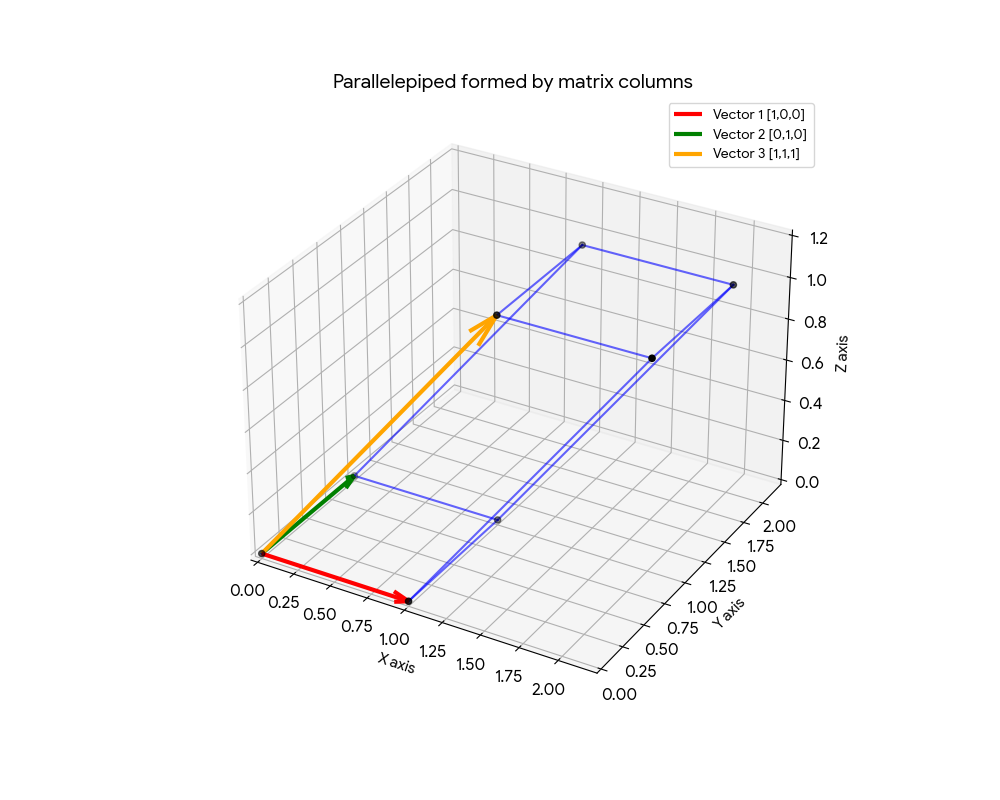

## The Determinant of a Square Matrix (矩阵的行列式)

The determinant is defined only for square matrices. For a $n \times n$ matrix $A$, the determinant of $A$, denoted as $det(A)$, is a scalar value.

For matrix

$$A = \begin{bmatrix} a_{1,1} & a_{1,2} & \cdots & a_{1,n} \\ a_{2,1} & a_{2,2} & \cdots & a_{2,n} \\ \vdots & \vdots & \ddots & \vdots \\ a_{n,1} & a_{n,2} & \cdots & a_{n,n} \end{bmatrix}$$

the determinant of $A$ can be denoted as

$$det(A) = \begin{vmatrix} a_{1,1} & a_{1,2} & \cdots & a_{1,n} \\ a_{2,1} & a_{2,2} & \cdots & a_{2,n} \\ \vdots & \vdots & \ddots & \vdots \\ a_{n,1} & a_{n,2} & \cdots & a_{n,n} \end{vmatrix}$$

### Computation of the Determinant

For a $2 \times 2$ matrix $A = \begin{bmatrix} a & b \\ c & d \end{bmatrix}$, the determinant is computed as:

$$det(A) = ad - bc$$

For a $3 \times 3$ matrix $A = \begin{bmatrix} a & b & c \\ d & e & f \\ g & h & i \end{bmatrix}$, the determinant is computed as:

$$det(A) = a(ei - fh) - b(di - fg) + c(dh - eg)$$

that is,

$$det(A) = a \begin{vmatrix} e & f \\ h & i \end{vmatrix} - b \begin{vmatrix} d & f \\ g & i \end{vmatrix} + c \begin{vmatrix} d & e \\ g & h \end{vmatrix}$$

For any square matrix $A$, let $A_{i,j}$ be the $(n-1) \times (n-1)$ matrix obtained by deleting the $i$-th row and $j$-th column of $A$. For example, for the above $3 \times 3$ matrix $A$, we have $A_{1,1} = \begin{bmatrix} e & f \\ h & i \end{bmatrix}$, $A_{1,2} = \begin{bmatrix} d & f \\ g & i \end{bmatrix}$, and $A_{1,3} = \begin{bmatrix} d & e \\ g & h \end{bmatrix}$.

Then we can compute the determinant of $A$ by expanding along the first row as follows:

$$det(A) = a_{1,1} \times det(A_{1,1}) - a_{1,2} \times det(A_{1,2}) + \cdots + (-1)^{n+1} a_{1,n} \times det(A_{1,n})$$

Specifically, if $A$ is a [triangular matrix](/hz8qe16p/#triangular-matrix-三角矩阵), then the determinant of $A$ is the product of the entries on the main diagonal of $A$. That is,

$$
det \begin{bmatrix} a_{1,1} & a_{1,2} & \cdots & a_{1,n} \\ 0 & a_{2,2} & \cdots & a_{2,n} \\ \vdots & \vdots & \ddots & \vdots \\ 0 & 0 & \cdots & a_{n,n} \end{bmatrix} = a_{1,1}a_{2,2}\cdots a_{n,n}
$$

### Rules of the Determinant

1. If $A$ is a square matrix and $B$ is obtained from $A$ by interchanging two rows, then $det(B) = -det(A)$.
2. If $A$ is a square matrix and $B$ is obtained from $A$ by multiplying a row of $A$ by a nonzero scalar $c$, then $det(B) = c \cdot det(A)$.
3. If $A$ is a square matrix and $B$ is obtained from $A$ by adding a scalar multiple of one row of $A$ to another row, then $det(B) = det(A)$.
4. $det(kA) = k^n \cdot det(A)$, where $k$ is a scalar.
5. $det(AB) = det(A) \cdot det(B)$, and $det(A^k) = (det(A))^k$ for any positive integer $k$.
6. $det(A^T) = det(A)$
7. $det(A^{-1}) = \frac{1}{det(A)}$ if $A$ is invertible.
8. $det(A+B)$ is NOT equal to $det(A) + det(B)$ in general.

### Geometric Interpretation of the Determinant

#### Area and Volume Scaling Factor

The determinant of a square matrix can be interpreted as the scaling factor of the linear transformation represented by the matrix. Specifically, if $A$ is an $n \times n$ matrix, then the absolute value of $det(A)$ represents how much the volume of a unit cube in $\mathbb{R}^n$ is scaled when transformed by $A$. If $det(A) = 0$, it means that the transformation collapses the space into a lower dimension, and thus the volume is reduced to zero.

#### Computing the Area or Volume of a Parallelogram

For a $2 \times 2$ matrix $A$, $|det(A)|$ gives the area of the parallelogram formed by the column vectors of $A$.

For a $3 \times 3$ matrix $A$, $|det(A)|$ gives the volume of the parallelepiped formed by the column vectors of $A$.

The column vectors of a matrix can be thought of as the edges of a parallelogram (in 2D) or a parallelepiped (in 3D) that connects the origin to the adjacent vertices (相邻顶点). Note that the origin is also one of the vertices of the parallelogram or parallelepiped.

For example, for the $3 \times 3$ matrix $A = \begin{bmatrix} 1 & 0 & 1 \\ 0 & 1 & 1 \\ 0 & 0 & 1 \end{bmatrix}$, the column vectors are $\begin{bmatrix} 1 \\ 0 \\ 0 \end{bmatrix}$, $\begin{bmatrix} 0 \\ 1 \\ 0 \end{bmatrix}$, and $\begin{bmatrix} 1 \\ 1 \\ 1 \end{bmatrix}$, and the parallelepiped formed by these three vectors looks like this:

## The Inverse of a Square Matrix (矩阵的逆)

### Definition

For a $n\times n$ square matrix $A$, if there exists a matrix $B$ such that $AB = BA = I_n$, then we call $B$ ==the inverse of $A$==, denoted as ==$A^{-1}$==, and we say that $A$ is ==invertible==.

A matrix is invertible if and only if its determinant is nonzero.

A matrix that is NOT invertible is called a ==singular matrix==, and a matrix that is invertible is called a ==nonsingular matrix==.

::: info
For a $2\times 2$ matrix $A = \begin{bmatrix} a & b \\ c & d \end{bmatrix}$, if $det(A) = ad - bc \neq 0$, then $A$ is invertible and

$$A^{-1} = \frac{1}{ad - bc} \begin{bmatrix} d & -b \\ -c & a \end{bmatrix}$$
:::

The inverse of a matrix has the following properties:

1. If $A$ is invertible, then $A^{-1}$ is also invertible and $(A^{-1})^{-1} = A$.
2. For invertible matrices, $(AB)^{-1} = B^{-1}A^{-1}$, $(ABC)^{-1} = C^{-1}B^{-1}A^{-1}$, etc.
3. If $A$ is invertible, then $A^T$ is also invertible and $(A^T)^{-1} = (A^{-1})^T$.

### Finding the Inverse of a Matrix

An $n \times n$ matrix $A$ is invertible if and only if $A$ is row equivalent to the identity matrix $I_n$. And in this case, we can find $A^{-1}$ by performing the same row operations on $I_n$.

As a result, we can find $A^{-1}$ by row reducing the augmented matrix $\begin{bmatrix} A & I_n \end{bmatrix}$ to the form $\begin{bmatrix} I_n & A^{-1} \end{bmatrix}$.
